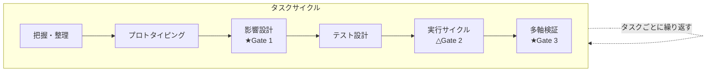
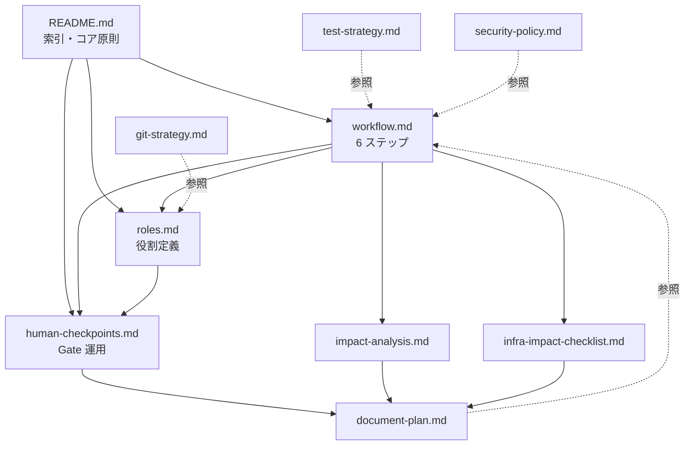

# チーム開発ガイドライン

本ガイドラインは、AI エージェントを活用した開発で **「動く」だけでなく「10 年後も読める／保守できる」プロダクト** を作るための、チーム共通の運用フレームワークである。

Web アプリ／API／バッチ／業務システム等を対象とし、あらゆる開発タスクに適用する。一回限りのスクリプト・実験コード・調査単発タスクは対象外。

リポジトリ非依存の汎用ガイドラインとして整備しており、各プロジェクトはこれをベースに自プロジェクト固有のルール（コーディング規約・配置規約・ツール固有設定など）を上乗せして運用する。

---

## 体制

本ガイドラインは、**3 + N 体制**（3 つの AI エージェント + N 名の人間レビュア）を前提とする。N は 1 以上であり、業務・QA・観点別補助評定者など複数の人間レビュアが関与する運用も前提に含む。

| 役割 | 担当 | 責務 | 詳細 |
|---|---|---|---|
| **計画エージェント** | AI | 仕様整理・タスク完了条件の定義 | [roles.md](roles.md) |
| **実装エージェント** | AI | テスト先行で実装 | [roles.md](roles.md) |
| **検証エージェント** | AI | 完了条件・テスト・セキュリティ・ドキュメント整合性の多軸検証 | [roles.md](roles.md) |
| **人間レビュア**（1 名以上） | 人間 | 3 つの Gate（Gate 1 / Gate 2 / Gate 3）で承認、利用者価値を最終判断 | [human-checkpoints.md](human-checkpoints.md) |

> **Gate** は通過判定点を意味する。各 Gate のタイミング・承認内容の詳細は [human-checkpoints.md](human-checkpoints.md) 参照。
> 人間レビュアが複数いる場合の運用は [human-checkpoints.md §レビュアー連携](human-checkpoints.md#レビュアー連携) 参照。

### 適用しない場合

人間のみで完結する作業（AI エージェントを使わないタスク）には適用しない。

---

## タスクサイクル

本ガイドラインは、**唯一のタスクサイクル** ですべての開発タスクを進める。プロダクトのライフサイクル全体に渡って、同じ 6 ステップを繰り返す。

### なぜ単一サイクルか

どのタスクも、本質的にやることは同じ：
- 何を作るかを **整理** する
- 必要なら **プロトタイピング** する
- **影響範囲** と **品質設計** を確認する
- **テスト** を設計する
- **計画 → 実装 → 検証** を回す
- **多軸で検証** する

各ステップは **対象があれば見る、なければ見ない** と同じ動作をする。フローを単一にすることで、運用ルールがブレない。

詳細な手順は [workflow.md](workflow.md) 参照。

---

## 全体構成

| ファイル | 内容 |
|---|---|
| [workflow.md](workflow.md) | タスクサイクル本体（6 ステップの手順） |
| [roles.md](roles.md) | 計画 / 実装 / 検証エージェントの役割・責務・禁止事項 |
| [test-strategy.md](test-strategy.md) | 品質特性モデル参照のテスト戦略テンプレート |
| [security-policy.md](security-policy.md) | セキュリティ方針テンプレート（観点別の採用／不採用） |
| [impact-analysis.md](impact-analysis.md) | 影響範囲分析（参照層／状態層／データ層）の運用手順 |
| [document-plan.md](document-plan.md) | ドキュメント計画（判断記録／API ／状態遷移／データモデル）テンプレート |
| [infra-impact-checklist.md](infra-impact-checklist.md) | インフラ影響チェックリスト |
| [human-checkpoints.md](human-checkpoints.md) | 人間の介入ポイント（スキップ可否定義） |
| [git-strategy.md](git-strategy.md) | Git 戦略（ブランチ／コミット／マージ運用・規約型・ホスティング非依存） |

---

## 利用ガイド

### 新規参加者の読む順序（オンボーディング）

ガイドライン群は 10 ファイル / 約 2,300 行ある. 以下の順序で読むと理解負担が下がる.

1. **本 README**（5〜10 分）: 全体像・体制・コア原則・用語
2. [workflow.md](workflow.md)（10〜15 分）: 6 ステップのタスクサイクル本体
3. [roles.md](roles.md)（10〜15 分）: 計画 / 実装 / 検証エージェントの役割と境界
4. [human-checkpoints.md](human-checkpoints.md)（10 分）: Gate 1 / 2 / 3 の運用と通過記録
5. テンプレート群（必要時に参照）:
   - [impact-analysis.md](impact-analysis.md): 影響範囲分析
   - [infra-impact-checklist.md](infra-impact-checklist.md): インフラ影響チェック
   - [test-strategy.md](test-strategy.md): テスト戦略
   - [security-policy.md](security-policy.md): セキュリティ方針
   - [document-plan.md](document-plan.md): ドキュメント計画
   - [git-strategy.md](git-strategy.md): Git 運用

### ファイル間の依存関係

実線が必須参照（直接的な依存）、点線が間接参照（テンプレート参照）.

### タスク開始時の運用

1. 本 README の「タスクサイクル」で全体像を把握する
2. [workflow.md](workflow.md) の 6 ステップに沿ってタスクを進める
3. ステップ 3「影響設計」で [impact-analysis.md](impact-analysis.md) と [infra-impact-checklist.md](infra-impact-checklist.md) を実施する
4. ステップ 5「実行サイクル」で [roles.md](roles.md) のエージェント分担を適用する
5. [human-checkpoints.md](human-checkpoints.md) で Gate（関門）の通過を確認する（タスク 1 件 = md 1 ファイルで集約）

### プロジェクトの初期セットアップ時

> **プロジェクト初期セットアップ**：プロジェクト発足時、最初のタスク開始前に行う準備作業。テスト戦略・セキュリティ方針・ドキュメント計画（品質設計の三本柱）の初版を整備する。

最初のタスク開始前に、品質設計の三本柱を整備する。

- テスト戦略：[test-strategy.md](test-strategy.md) のテンプレートで初版を作成
- セキュリティ方針：[security-policy.md](security-policy.md) のテンプレートで初版を作成
- ドキュメント計画：[document-plan.md](document-plan.md) のテンプレートで配置先を確定

以降のタスクでは、ステップ 3「影響設計」の中でこれらを **確認・必要があれば更新** する。

---

## コア原則（5 つ）

1. **品質設計は最初に決める**：テスト・セキュリティ・ドキュメント計画を後付けしない
2. **完了条件は「機能 + テスト + ドキュメント」**：3 点セットで揃わなければ完了としない
3. **エージェントは責務分離**：計画が決め、実装が作り、検証が確かめる。1 体に全部やらせない
4. **人間の Gate（関門）は飛ばさない**：Gate 1（影響設計の承認）と Gate 3（最終確認）は必須・スキップ不可。Gate 2（完了条件の確認）は推奨で、小タスクのみ省略可（基準は [human-checkpoints.md](human-checkpoints.md)）
5. **ドキュメントは一次情報源**：実装の前後で更新し、コードと乖離させない

---

## 品質設計の三本柱と多軸検証の 5 観点の関係

三本柱は **設計時の方針**（影響設計＝ステップ 3 で確認）、5 観点は **完了時の検証**（多軸検証＝ステップ 6）。役割が違うので粒度も違う。

本セクションは **多軸検証 5 観点の一次情報源** として、定義をここに集約する.

| 三本柱（影響設計時に確認） | 多軸検証の 5 観点（タスク完了時に検証） |
|---|---|
| **テスト戦略** ([test-strategy.md](test-strategy.md)) | 観点 2: **テストの構造品質**（カバレッジ・命名・既存テスト未変更）|
| **セキュリティ方針** ([security-policy.md](security-policy.md)) | 観点 4: **セキュリティ** |
| **ドキュメント計画** ([document-plan.md](document-plan.md)) | 観点 5: **ドキュメント整合性** |
| （横断観点）| 観点 1: **コード品質**（静的解析・型チェック・命名・複雑度・重複）|
| （完了条件レンズ）| 観点 3: **機能完全性**（完了条件達成・スコープ外不在）|

各観点の確認内容と並列レビュー時の合体許容ルールは [roles.md の検証エージェント章](roles.md#検証エージェントverifier) を参照する.

---

## 用語

> AI エージェント（計画／実装／検証）と Gate（Gate 1 / Gate 2 / Gate 3）の定義は「[体制](#体制)」セクション参照。

| 用語 | 意味 |
|---|---|
| **Gate**（=関門 / checkpoint） | 通過判定点。本ガイドラインでは「Gate」を一次表記とする. ファイル名 `human-checkpoints.md` の `checkpoints` も同義 |
| **タスクサイクル** | 1 タスクを進める 6 ステップの単一サイクル（[workflow.md](workflow.md)） |
| **品質設計の三本柱** | テスト戦略／セキュリティ方針／ドキュメント計画の 3 点セット |
| **影響範囲分析** | 改修時に行う参照層／状態層／データ層の 3 つの層に分けた分析 |
| **多軸検証** | 5 観点（コード品質／テストの構造品質／機能完全性／セキュリティ／ドキュメント整合性）の並列検証 |
| **タスク 1 md 統合方式** | Gate 1 / 2 / 3 の通過記録を 1 つの md ファイルに集約する運用方式（[human-checkpoints.md](human-checkpoints.md)）|
| **3 + N 体制** | 3 つの AI エージェント（計画・実装・検証）+ N 名（1 以上）の人間レビュアで構成する本ガイドラインの前提体制 |
| **レビュアー向けサマリ** | 各 Gate セクション先頭に記載する 3 点固定（判断要請・重要な変更ポイント・確認してほしい観点）の要約。レビュアーの判断負荷を下げる目的（[human-checkpoints.md §レビュアー連携](human-checkpoints.md#レビュアー連携)）|
| **レビュアー記入欄** | 各 Gate セクション末尾に設ける、人間レビュアの判断結果記入欄。最低項目（承認者・依頼日・回答日・結論・コメント）を含む自由記述形式 |
| **一次情報源** | 信頼できる正本となる情報源。ドキュメントを正の情報源とする原則 |
| **ADR**（Architecture Decision Record） | 技術判断を時系列で記録するドキュメント形式。「アーキテクチャ判断記録」と同義（[document-plan.md](document-plan.md) を一次情報源とする）|
| **静的解析** | コードを実行せずに構造を解析する手法 |
| **リフレクション** | 実行時にコード構造を参照する機構。全文検索で見落としやすいため別途確認 |
| **冪等性キー** | 同じ操作を繰り返しても結果が変わらないようにする識別子 |
| **ドライラン** | 本番実行前の予行演習。検証環境で同条件を再現する |
| **サーキットブレーカー** | 連鎖障害を防ぐ遮断機構。閾値超過で外部呼び出しを一時停止する |
| **フィーチャーフラグ** | 機能の有効／無効を切り替えるスイッチ。デプロイ後の有効化制御に使う |
| **カナリアリリース** | 一部利用者から段階的に展開する手法。本番影響を限定する |
| **継続的インテグレーション**（CI） | プルリクエスト等の契機でテスト・静的解析を自動実行する仕組み |
| **プロジェクト初期セットアップ** | プロジェクト発足時、最初のタスク開始前に品質設計の三本柱の初版を整備する準備作業 |
