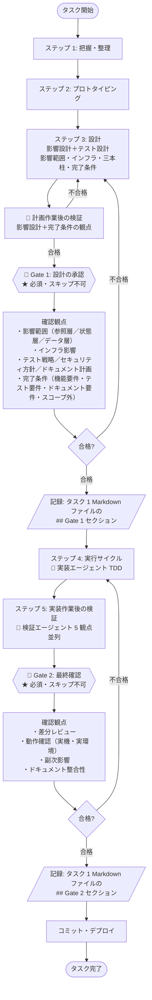

# 人間の介入ポイント

AI エージェントに任せられる作業と、**人間が必ず通すべき Gate（関門）** を分ける。

> **コア原則**: AI が保証できるのは「テストが通った」までで、**「利用者にとって正しい」かは保証できない**。最終判断は必ず人間が行う。

---

## 2 つの Gate（関門）

> **Gate** は通過判定点を意味する。タスクが次の段階へ進む前に必ず通過する。

| Gate | 位置付け | 内容 |
|---|---|---|
| **Gate 1** | ★ 必須・スキップ不可 | 設計の承認（影響設計＋テスト設計＋完了条件） |
| **Gate 2** | ★ 必須・スキップ不可 | 最終確認（差分・動作確認） |



---

## Gate 1: 設計の承認

影響設計・テスト設計・完了条件を **1 つの設計フェーズ**として承認する関門。

### タイミング

[workflow.md](workflow.md) の「ステップ 3: 設計（影響設計＋テスト設計）」完了時・実装着手前。

### 確認内容

**影響設計の観点**

| 観点 | 問い |
|---|---|
| **影響範囲分析** | 参照層・状態層・データ層の各層を網羅したか（[impact-analysis.md](impact-analysis.md) §0 の変更属性チェック実施済か）|
| **インフラ影響** | チェックリスト（[infra-impact-checklist.md](infra-impact-checklist.md)）を通したか |
| **依存追加判断** | 新規ライブラリ採否を確定し、必要なアーキテクチャ判断記録（ADR）を起票済か |
| **テスト戦略** | 品質特性ベースで採用／不採用が明確か。理由が妥当か |
| **セキュリティ方針** | [security-policy.md](security-policy.md) の段階定義が明確か |
| **ドキュメント計画** | いつ・何を・誰が書くかが明確か |

**完了条件の観点**

| 観点 | 問い |
|---|---|
| **機能要件** | やることがすべて列挙されているか |
| **テスト要件** | 必要なテスト種別・観点が網羅されているか（テスト設計が済んでいるか） |
| **ドキュメント要件** | 更新すべきドキュメントが明示されているか |
| **スコープ外** | 「やらないこと」が明示されているか |

> 計画エージェントの設計作業（影響設計＋テスト設計）後に、検証エージェントが成果物を検証する（観点：影響範囲網羅性 / インフラ影響 / 三本柱整合性 / スコープ確定 / 依存追加判断 / 機能要件 / テスト要件 / ドキュメント要件 / 状態遷移マトリクス）。[roles.md](roles.md) 参照。Gate 1 を通すなら検証も必須。

### スキップ可否

**不可**。「軽微なタスクだから」という理由でスキップしない。

- 品質設計を決めずに進むと、後段で全部やり直しになる
- 影響設計レビューを飛ばすと、本番事故の原因になる

### 承認の形式

タスク 1 Markdown ファイル（[§通過記録](#通過記録-タスク-1-markdown-ファイル統合方式) 参照）の `## Gate 1` セクションに記載する。サブセクション構造（レビュアー向けサマリ・重点観点・レビュアー記入欄）は [§レビュアー連携](#レビュアー連携) を参照する。

- 重点観点: 影響範囲分析・三本柱・スコープ・依存追加判断・完了条件（機能要件・テスト要件・ドキュメント要件・スコープ外） 等
- レビュアー記入欄の最低項目: 承認者・レビュー依頼日・回答日・結論（合格 / 差し戻し）

---

## Gate 2: 最終確認

### タイミング

実装作業後の検証が合格した後・**コミット前**。

### 確認内容

| 観点 | 問い |
|---|---|
| **差分レビュー** | 完了条件と差分が一致しているか |
| **動作確認** | 実機・実環境で「利用者視点で正しい」か |
| **副次影響** | 他機能への副次影響がないか |
| **ドキュメント整合性** | 最終的にドキュメントとコードが一致しているか |

> 実装エージェントの作業後に、検証エージェントが 5 観点で成果物を検証する。詳細は [workflow.md ステップ 5](workflow.md#ステップ-5実装作業後の検証gate-2) 参照。

### スキップ可否

**不可**。AI が「テストが通った」と言っても利用者価値の判定にはならない。
ドキュメントのみの修正・typo 修正は省略可（各プロジェクトの規約に従う）。

### Gate 2 で確認すべき「利用者にとって正しい」とは

- 表示文言が自然か（誤訳・違和感がないか）
- 画面遷移がスムーズか
- エラー時のメッセージが分かりやすいか
- 体感的な性能に違和感がないか
- 期待動作と実装動作のズレがないか

これらは **AI には判定できない**。必ず人間が実機で操作する。

### 承認の形式

タスク 1 Markdown ファイルの `## Gate 2` セクションに記載する。サブセクション構造（レビュアー向けサマリ・重点観点・レビュアー記入欄）は [§レビュアー連携](#レビュアー連携) を参照する。

- 重点観点: 差分レビュー・実機動作確認結果・副次影響・ドキュメント整合性
- レビュアー記入欄の最低項目: 承認者・レビュー依頼日・回答日・結論（合格 / 差し戻し）

---

## 通過記録: タスク 1 Markdown ファイル統合方式

すべての Gate（1 / 2）の通過記録は **タスクごとに 1 つの Markdown ファイル** に集約する。Markdown ファイルが一次情報源であり、ホスティングサービスのプルリクエストや課題管理ツールは補助参照に過ぎない（ツール非依存）。

| 観点 | 規定 |
|---|---|
| 配置 | `<docs>/notes/T<タスクID>-<件名>.md` 1 ファイル（プロジェクトの命名規約に従う）|
| 構造 | **冒頭にレビュー判定UI部** を置き、後段に AI 作業ログ部を **`<details>` で折りたたんで** 配置する（[§骨格テンプレ](#タスク-1-markdown-ファイルの骨格テンプレ) 参照）|
| 一次情報源 | Markdown ファイル（バージョン管理システムで履歴管理）|
| ツール連携 | 任意。プルリクエスト / Issue / 課題管理ツールを使う場合は Markdown ファイルへのリンクのみ記載し、レビューコメントも Markdown ファイルに集約する |
| 承認後の編集 | **禁止**。差し戻し時は「Gate N 再実施」セクションを新規追記する（既存セクションは履歴として残す）|

### レビュー判定UI部とAI作業ログ部の分離

タスク 1 Markdown ファイルは **2層構造** で書く。レビュアーは前半（レビュー判定UI部）だけで判定でき、AI エージェントは後半（AI 作業ログ部）の詳細根拠まで参照できる。

| 部位 | 主な読者 | 内容 | 配置 |
|---|---|---|---|
| **レビュー判定UI部** | 人間レビュア | タスク要約 / Gate 進捗早見 / 影響範囲タイプ早見 / Gate 1・2 の判定セクション | ファイル冒頭〜中段（折りたたみなし）|
| **AI 作業ログ部** | AI エージェント / 詳細追跡したいレビュア | ステップ 1〜6 の作業ログ（影響範囲分析の詳細表・テスト設計マトリクス・実装メモ 等） | `<details>` 配下に折りたたむ |

> **趣旨**: 初見のレビュアーが本ファイル冒頭の数十行で Gate 判定に必要な情報を把握できる状態を保ちつつ、AI エージェントが規約の精度を保つために必要な作業証跡を同一ファイル内に保持する。レビュー判定UI部の構造は厳守し、AI 作業ログ部の見出し体系・粒度はタスク特性に応じて自由に書く。

### 一次情報源（Markdown）とレビュー提示層（HTML 等）の分離

タスク記録は **読み手で媒体を分離する**。同じ内容を二重管理するのではなく、一次情報源（Markdown）から人間向けの提示層（HTML 等）を**再生成**する関係に固定する。

- **Markdown ＝ AI の作業記録**: 唯一の一次情報源。バージョン管理で差分レビュー・履歴追跡・検索・ツール非依存を担保し、AI エージェントが読み書きする保守対象。
- **HTML ＝ 人間の閲覧窓口**: 人間がレビュー・確認するための読みやすい提示層。Markdown から再生成できる **使い捨て**であり、**バージョン管理の対象外**（保守対象は Markdown 一次情報源に固定する）。

**人間がレビュー・確認する局面では、人間向けの提示層（HTML 等）を用意する**（★必須）。「テストが通った」と「利用者にとって正しい」を人間が見極めるには、レビュアが実際に読み・理解できる形で情報を届ける必要があるためである。Markdown を直接読める人がそれで足りる場合でも、人間向けの正面の窓口は提示層に置く。

| 観点 | 規定 |
|---|---|
| 一次情報源 | **Markdown ファイル**（変更不可の原則。提示層が一次情報源を兼ねることはない）|
| 提示層（HTML 等）の位置づけ | 人間の閲覧窓口。Markdown から再生成可能な **使い捨て成果物**。差分・フローチャート・複数案の横並び・重大度の色分け等、Markdown で表現しづらい情報の可読化に用いる |
| バージョン管理 | 各タスクの**生成済み提示層は git 管理対象外**（`.gitignore` 等で除外し、一次情報源から随時再生成する）。保守する差分は Markdown 側にのみ残す。ただし本書が配布する**見本テンプレ（[task-record-template.html](task-record-template.html)）は git 管理対象**（管理対象外は生成済みインスタンスのみ）|
| 生成タイミング | タスク起票時に生成し、Gate 記録の更新ごとに再生成して最新化する（具体の生成手段・強制度はプロジェクト裁量）|
| 設計方針 | **認知負荷最適化の再構成**（Markdown の 1:1 レンダリングではない）。判定に必要な最小情報（タスク要約・Gate 進捗・各 Gate の判断要請と結論）を上部に集約し、重点観点・影響範囲・レビュアー記入欄・AI 作業ログは折りたたみ／下部へ退避する。見本: [task-record-template.html](task-record-template.html) |
| 配置・形式 | プロジェクトの命名・配置規約に従う（専用ディレクトリにまとめる等）。外部依存のない単一自己完結 HTML 等、オフラインでも開ける形式を推奨 |
| 一次情報源からのリンク | git 管理外の提示層へ、git 管理される一次情報源からリンクを張ると clone 直後にリンク切れになる。**原則リンクしない**（人間は提示層を直接開く）|
| 禁止 | 提示層のみで Gate 判定記録を完結させること。判定結論・承認者・コメントは必ず一次情報源（Markdown）の Gate セクションに記載する |

> **趣旨**: 「人間が AI の判断に関与し続ける（ループに留まる）」ため、レビュアが実際に読み・理解できる人間向けの窓口を常設する。一方、保守対象として残る一次情報源は差分追跡可能な Markdown に固定し、提示層は再生成可能な使い捨てとして git 管理から外す。**人間向け提示層を用意すること自体は必須**だが、生成手段・形式・配置はプロジェクト裁量とする。

### タスク 1 Markdown ファイルの骨格テンプレ

骨格テンプレの正本は **[task-record-template.md](task-record-template.md)** に独立ファイルとして配置する（本書はそれを参照する）。タスク起票時は同ファイルのコードブロックをコピーして `<docs>/notes/T<タスクID>-<件名>.md` を作成する。

> **人間向け提示層（HTML）の見本**は [task-record-template.html](task-record-template.html)。Markdown から再生成する閲覧窓口であり、設計方針は本書「一次情報源（Markdown）とレビュー提示層（HTML 等）の分離」を参照する。

### テンプレ運用の補足

| 観点 | 規定 |
|---|---|
| **レビュー判定UI部の改変** | レビュアー向けサマリ・重点観点・レビュアー記入欄の **3 サブセクション構造は省略不可**。タスク特性に応じて項目を追加するのは可。 |
| **AI 作業ログ部の改変** | `<details>` 配下の見出し体系・粒度はタスク特性に応じて自由に書いてよい。テンプレの 5 ステップ構造を踏襲することは推奨だが必須ではない。 |
| **判定欄の必須項目** | 承認者・依頼日・回答日・**結論（合格 / 差し戻し）**・**コメント**。結論とコメントは欠落不可（後から判別不能になるため）。 |
| **Gate 進捗 早見表の更新** | 各 Gate の状態が変わるたびに更新する（依頼中→合格、依頼中→差し戻し 等）。 |
| **影響範囲タイプ 早見の更新** | ステップ 3 の影響範囲分析が確定した時点で 1 度埋め、以降は変更なし。 |

---

## レビュアー連携

タスク 1 Markdown ファイルは **そのまま人間レビュアへの一次連携手段** として用いる。連携手段（誰がいつどう渡すか）は **プロジェクト裁量** とし、本書は Markdown ファイルの構造のみを規定する（チャットツール通知・課題管理ツール起票・メール等は本書の規定対象外）。

### 各 Gate セクションのサブセクション構造

各 Gate セクション（`## Gate 1` / `## Gate 2`）は以下の 3 サブセクション構造で記載する。

| サブセクション | 記入主体 | 内容 |
|---|---|---|
| **レビュアー向けサマリ** | 計画 / 実装エージェント | 3 点固定（判断要請・重要な変更ポイント 3-5 件・確認してほしい観点 1-3 件） |
| **重点観点** | 計画 / 実装エージェント | Gate ごとの確認内容（影響範囲・三本柱・差分・動作確認 等）。検証エージェントが直前の AI 作業後に確認した観点もここに含める |
| **レビュアー記入欄** | 人間レビュア | 自由記述。最低項目（承認者・レビュー依頼日・回答日・結論）を含む |

具体構造は [§タスク 1 Markdown ファイルの骨格テンプレ](#タスク-1-markdown-ファイルの骨格テンプレ) を参照する。

### Gate ごとの重点観点（記載例）

| Gate | 重点観点 |
|---|---|
| **Gate 1** | 影響範囲分析（参照層・状態層・データ層）／三本柱（テスト戦略・セキュリティ方針・ドキュメント計画）／スコープ（コア・後回し・対象外）／依存追加判断／完了条件（機能要件・テスト要件・ドキュメント要件・スコープ外宣言） |
| **Gate 2** | 差分レビュー／実機動作確認結果／副次影響／ドキュメント整合性 |

### レビュアー向けサマリの 3 点固定構造

各 Gate セクションの先頭に、レビュアー向けサマリを **3 点固定** で記載する。レビュアーが本文を読む前にこのサマリだけで判断観点を把握できるよう、簡潔に書く。

```markdown
### レビュアー向けサマリ
- **判断してほしいこと**: <1-2 文。Gate ごとの判断要請を明示>
- **重要な変更ポイント**: <3-5 件、箇条書き>
- **確認してほしい観点**: <1-3 件、箇条書き>
```

| 項目 | 目安分量 | 内容 |
|---|---|---|
| 判断してほしいこと | 1-2 文 | レビュアーに何を判断してほしいかを明示する |
| 重要な変更ポイント | 3-5 件 | 全変更のうち、レビューで重点的に見てほしい箇所を抽出して箇条書き |
| 確認してほしい観点 | 1-3 件 | 「見落としやすい」「判断に迷う」観点を絞って例示 |

### レビュアー記入欄

各 Gate セクションの末尾に、人間レビュアが判断結果を記入する欄を設ける。形式は **自由記述** だが、以下の最低項目を必ず含める。

| 項目 | 内容 |
|---|---|
| 承認者 | 氏名・役割（役割分類はプロジェクト裁量） |
| レビュー依頼日 | YYYY-MM-DD |
| 回答日 | YYYY-MM-DD（承認日 / 差戻日のいずれか） |
| 結論 | 合格 / 差し戻し |
| コメント | 自由記述 |

### 複数レビュアの並列記入

1 つの Gate に複数の人間レビュアが関与する場合、**同セクション内のレビュアー記入欄に複数エントリを並列追記** する。

| 規定 | 内容 |
|---|---|
| 並列追記の構造 | レビュアー記入欄の中に、レビュアーごとのエントリを上から時系列で追記する |
| 個別判断の独立性 | 各レビュアーの判断はそれぞれ独立して記入し、他レビュアーの判断に追従しない |
| Gate 通過の根拠 | **すべてのレビュアーが「合格」のとき** に Gate 通過とする。1 名でも「差し戻し」を出した場合は Gate 不合格扱い |
| 差し戻し時 | [§Gate の差し戻し](#gate-の差し戻し) のルールを踏襲し、「Gate N 再実施」セクションを新規追記する |

### 添付情報

スクリーンショット・ログ・実行結果等の添付物は、`<docs>/notes/T<タスクID>-attachments/` 配下に配置し、Markdown ファイルからは **相対リンクで参照** する。Markdown ファイル本文には要約のみを記載する。

```markdown
### Gate 2 重点観点

#### 動作確認結果
- 検索画面: 正常動作（[スクショ](T1234-attachments/gate2-search.png)）
- 一覧画面: 正常動作（[スクショ](T1234-attachments/gate2-list.png)）
- 異常系ログ: 異常なし（[ログ](T1234-attachments/gate2-server.log)）
```

### 差し戻し時の運用

差し戻し時の運用は [§Gate の差し戻し](#gate-の差し戻し) を参照する。**既存の Gate N セクション（およびそのレビュアー記入欄）は編集禁止** とし、「Gate N 再実施」セクションを末尾に新規追記する。再実施セクションも本節と同じサブセクション構造（レビュアー向けサマリ／重点観点／レビュアー記入欄）で記載する。

---

## Gate の差し戻し

| Gate | 差し戻し先 |
|---|---|
| Gate 1 不合格 | 「ステップ 3: 設計」に戻り、影響範囲・品質設計・完了条件を再検討 |
| Gate 2 不合格 | 実装エージェントに戻し、修正後に再検証 → 再 Gate 2 |

差し戻し時は、タスク 1 Markdown ファイルの末尾に **「Gate N 再実施」セクション** を新規追記する（既存の Gate N セクションは編集禁止、履歴として残す）。

### Gate のスキップ違反

- Gate スキップ違反を発見した場合、**該当タスクを完了扱いにしない**
- 違反パターンを議事メモ（[document-plan.md](document-plan.md) の議事メモ種別を参照）に記録し、再発防止策を検討する

---

## AI エージェント運用との関係

| AI に任せること | 人間が判断すること |
|---|---|
| 完了条件に基づく実装 | 完了条件そのものの妥当性（Gate 1） |
| テスト網羅性のチェック | テスト戦略そのものの選定（Gate 1） |
| ドキュメント更新の有無確認 | ドキュメント計画そのものの設計（Gate 1） |
| 一般的な脆弱性観点でのセキュリティ確認 | セキュリティ方針そのものの段階定義（Gate 1） |
| 動作確認の自動実行 | 利用者価値としての正しさ（Gate 2） |
| AI 作業後の検証（観点漏れ抽出・整合性チェック） | Gate の最終承認 |

「AI が確認した」だけで Gate 通過にしない。**人間の承認** を伴うことが Gate の本質である。検証エージェントによる確認は Gate を代替するものではなく前段補助であり、Gate 通過の判定権限はあくまで人間レビュアにある。

---

## 更新履歴

| 日付 | バージョン | 概要 |
|---|---|---|
| 2026-04-28 | 1.0.0 | 初版（v1.0 として整備） |
| 2026-05-05 | 1.1.0 | 検証エージェントの実施タイミングを「計画/実装エージェントの作業後」と整理。フロー図のラベル・各 Gate の補足注記から「多軸検証」用語を削除 |
| 2026-05-05 | 1.2.0 | タスク 1 Markdown ファイルを「レビュー判定UI部 + AI 作業ログ部（`<details>`）」の 2 層構造に整理。骨格テンプレに「タスク要約」「Gate 進捗 早見表」「影響範囲タイプ 早見」を追加。Gate 判定欄を表形式に変更し、結論・コメントの必須を明示 |
| 2026-06-03 | 1.3.0 | 「一次情報源（Markdown）とレビュー提示層（HTML 等）の分離」節を追加。Markdown を唯一の一次情報源に固定しつつ、変更点が多い場合にレビュー可読化目的の使い捨て提示層を補助併用してよい旨を規定 |
| 2026-06-16 | 2.0.0 | **3 ゲート → 2 ゲートへ集約**。旧 Gate 2「完了条件の確認」を Gate 1（「設計の承認」へ改称）に統合し、テスト設計を設計フェーズへ前倒し。旧 Gate 3「最終確認」を Gate 2 へ繰り上げ。旧 Gate 2 の運用ルート（正式 / インライン / 省略）と小タスク省略基準を廃止し Gate 1 を必須・スキップ不可に一本化。マージ以降の新規タスクから発効（進行中タスクは従前の運用で完了） |
| 2026-06-22 | 2.1.1 | 2 ゲート化の取りこぼし表記を是正。通過記録の `Gate（1 / 2 / 3）`・レビュー判定UI部の `Gate 1・2・3`・添付例のファイル名 `gate3-*` をそれぞれ Gate 1 / 2（`gate2-*`）へ修正（履歴行・本文の他箇所は既に 2 ゲート整合済み） |
| 2026-06-16 | 2.1.0 | **「一次情報源（Markdown）とレビュー提示層（HTML 等）の分離」節を格上げ**。「読み手で媒体を分ける」常設原則（**Markdown＝AI の作業記録 / HTML＝人間の閲覧窓口**）へ改訂し、「変更点が多い場合に限り補助併用してよい（任意）」→「**人間がレビュー・確認する局面では人間向け提示層を用意する（★必須）**」へ。提示層を **git 管理対象外の再生成可能な使い捨て層** と明記し、生成タイミング（起票時・Gate 更新時に再生成）・一次情報源からは原則リンクしない旨を追加。生成手段・形式・配置はプロジェクト裁量を維持 |
| 2026-06-23 | 2.2.0 | **人間レビューの認知負荷を低減**。骨格テンプレのコードブロックを正本ファイル [task-record-template.md](task-record-template.md) へ独立化し本書は参照に変更（二重管理回避）。HTML 提示層の**見本** [task-record-template.html](task-record-template.html)（自己完結・外部依存なし）を同梱し、設計方針を **認知負荷最適化の再構成**（判定に必要な最小情報を上部集約／詳細は折りたたみ）と明記。見本テンプレは git 管理対象・生成済みインスタンスは管理対象外と区別を追記 |
