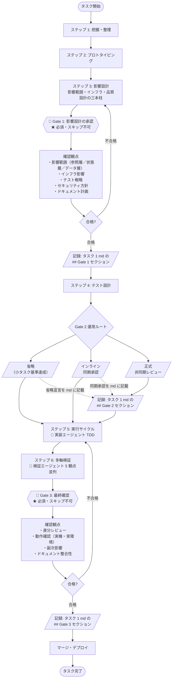

# 人間の介入ポイント

AI エージェントに任せられる作業と、**人間が必ず通すべき Gate（関門）** を分ける。

> **コア原則**: AI が保証できるのは「テストが通った」までで、**「利用者にとって正しい」かは保証できない**。最終判断は必ず人間が行う。

---

## 3 つの Gate（関門）

> **Gate** は通過判定点を意味する。タスクが次の段階へ進む前に必ず通過する。

| Gate | 位置付け | 内容 |
|---|---|---|
| **Gate 1** | ★ 必須・スキップ不可 | 影響設計の承認 |
| **Gate 2** | △ 推奨・運用ルートを 3 種から選択 | 完了条件の確認 |
| **Gate 3** | ★ 必須・スキップ不可 | 最終確認（差分・動作確認） |



---

## Gate 1: 影響設計の承認

### タイミング

[workflow.md](workflow.md) の「ステップ 3: 影響設計」完了時。

### 確認内容

| 観点 | 問い |
|---|---|
| **影響範囲分析** | 参照層・状態層・データ層の各層を網羅したか（[impact-analysis.md](impact-analysis.md) §0 の変更属性チェック実施済か）|
| **インフラ影響** | チェックリスト（[infra-impact-checklist.md](infra-impact-checklist.md)）を通したか |
| **依存追加判断** | 新規ライブラリ採否を確定し、必要なアーキテクチャ判断記録（ADR）を起票済か |
| **テスト戦略** | 品質特性ベースで採用／不採用が明確か。理由が妥当か |
| **セキュリティ方針** | [security-policy.md](security-policy.md) の段階定義が明確か |
| **ドキュメント計画** | いつ・何を・誰が書くかが明確か |

### スキップ可否

**不可**。「軽微なタスクだから」という理由でスキップしない。

- 品質設計を決めずに進むと、後段で全部やり直しになる
- 影響設計レビューを飛ばすと、本番事故の原因になる

### 承認の形式

タスク 1 md（[§通過記録](#通過記録-タスク-1-md-統合方式) 参照）の `## Gate 1` セクションに記載する。サブセクション構造（レビュアー向けサマリ・重点観点・レビュアー記入欄）は [§レビュアー連携](#レビュアー連携) を参照する。

- 重点観点: 影響範囲分析・三本柱・スコープ・依存追加判断 等
- レビュアー記入欄の最低項目: 承認者・レビュー依頼日・回答日・結論（合格 / 差し戻し）

---

## Gate 2: 完了条件の確認

### タイミング

ステップ 4（テスト設計）完了後・ステップ 5（実行サイクル）開始前。すなわち、実装エージェントが作業に入る前。

### 確認内容

| 観点 | 問い |
|---|---|
| **機能要件** | やることがすべて列挙されているか |
| **テスト要件** | 必要なテスト種別・観点が網羅されているか |
| **ドキュメント要件** | 更新すべきドキュメントが明示されているか |
| **スコープ外** | 「やらないこと」が明示されているか |

### 運用ルート（3 種）

タスクの規模・体制・タイミングに応じて以下 3 ルートから選ぶ。**どのルートでも `## Gate 2` セクションへの記録は省略不可**（記載内容が異なるだけ）。

| ルート | 適用条件 | 記録内容 |
|---|---|---|
| **正式** | 完了条件のレビューに同期承認が困難な場合（非同期レビュー）| 計画エージェントが完了条件を提示 → 人間レビュアが承認コメント → md に記録 |
| **インライン** | 完了条件が短く、提示と承認がほぼ同期する場合 | 同期承認の事実と承認内容を md に「インライン承認」として記録 |
| **省略** | 後述「小タスク」基準を **すべて** 満たす場合 | 「省略（小タスク基準達成）」と md に記載、満たした基準の根拠を併記 |

### 「小タスク」の判定基準（省略可の条件）

以下を **すべて** 満たす場合のみ省略ルートを選べる。1 つでも該当しないなら正式またはインラインを通す。

- [ ] 影響範囲が単一ファイル・単一関数
- [ ] テストケース数が 3 件以下で済む
- [ ] ドキュメント更新が不要
- [ ] 既存仕様への影響なし
- [ ] セキュリティ・性能への影響なし

---

## Gate 3: 最終確認

### タイミング

多軸検証合格後・マージ前。

### 確認内容

| 観点 | 問い |
|---|---|
| **差分レビュー** | 完了条件と差分が一致しているか |
| **動作確認** | 実機・実環境で「利用者視点で正しい」か |
| **副次影響** | 他機能への副次影響がないか |
| **ドキュメント整合性** | 最終的にドキュメントとコードが一致しているか |

### スキップ可否

**不可**。AI が「テストが通った」と言っても利用者価値の判定にはならない。
ドキュメントのみの修正・typo 修正は省略可（各プロジェクトの規約に従う）。

### Gate 3 で確認すべき「利用者にとって正しい」とは

- 表示文言が自然か（誤訳・違和感がないか）
- 画面遷移がスムーズか
- エラー時のメッセージが分かりやすいか
- 体感的な性能に違和感がないか
- 期待動作と実装動作のズレがないか

これらは **AI には判定できない**。必ず人間が実機で操作する。

### 承認の形式

タスク 1 md の `## Gate 3` セクションに記載する。サブセクション構造（レビュアー向けサマリ・重点観点・レビュアー記入欄）は [§レビュアー連携](#レビュアー連携) を参照する。

- 重点観点: 差分レビュー・実機動作確認結果・副次影響・ドキュメント整合性
- レビュアー記入欄の最低項目: 承認者・レビュー依頼日・回答日・結論（合格 / 差し戻し）

---

## 通過記録: タスク 1 md 統合方式

すべての Gate（1 / 2 / 3）の通過記録は **タスクごとに 1 つの md ファイル** に集約する。md ファイルが一次情報源であり、ホスティングサービスのプルリクエストや課題管理ツールは補助参照に過ぎない（ツール非依存）。

| 観点 | 規定 |
|---|---|
| 配置 | `<docs>/notes/T<タスクID>-<件名>.md` 1 ファイル（プロジェクトの命名規約に従う）|
| 構造 | `## Gate 1` / `## Gate 2` / `## Gate 3` セクションを時系列で追記 |
| 一次情報源 | md ファイル（バージョン管理システムで履歴管理）|
| ツール連携 | 任意。プルリクエスト / Issue / 課題管理ツールを使う場合は md ファイルへのリンクのみ記載し、レビューコメントも md に集約する |
| 承認後の編集 | **禁止**。差し戻し時は「Gate N 再実施」セクションを新規追記する（既存セクションは履歴として残す）|

### 推奨ファイル構造

```markdown
# Task <ID>: <件名>

- 着手日 / 完了日 / 担当 / 関連リンク（事前計画ドキュメント等）

## Gate 1: 影響設計の承認

### レビュアー向けサマリ
- 判断してほしいこと: <例: 影響範囲分析の網羅性が十分か>
- 重要な変更ポイント: <3-5 件、箇条書き>
- 確認してほしい観点: <1-3 件、箇条書き>

### 重点観点
- 影響範囲分析（参照層 / 状態層 / データ層）
- 三本柱（テスト戦略 / セキュリティ方針 / ドキュメント計画）
- スコープ確定（コア / 後回し / 対象外）
- 依存追加判断（該当時のみ。ADR への参照）

### レビュアー記入欄
- 承認者: <氏名・役割>
- レビュー依頼日: YYYY-MM-DD
- 回答日: YYYY-MM-DD
- 結論: 合格 / 差し戻し
- コメント: <自由記述>

## Gate 2: 完了条件の確認

### 運用ルート
正式 / インライン / 省略（省略時は小タスク基準達成の根拠を併記）

### レビュアー向けサマリ（インライン・正式時のみ。省略時は不要）
- 判断してほしいこと: <例: 完了条件が機能・テスト・ドキュメントの 3 点セットで揃っているか>
- 重要な変更ポイント: <3-5 件>
- 確認してほしい観点: <1-3 件>

### 重点観点
- 機能要件 / テスト要件 / ドキュメント要件 / スコープ外宣言

### レビュアー記入欄（インライン・正式時のみ）
- 承認者: <氏名・役割>
- レビュー依頼日: YYYY-MM-DD
- 回答日: YYYY-MM-DD
- 結論: 合格 / 差し戻し
- コメント: <自由記述>

## Gate 3: 最終確認

### レビュアー向けサマリ
- 判断してほしいこと: <例: 利用者視点で正しいか / 副次影響がないか>
- 重要な変更ポイント: <3-5 件>
- 確認してほしい観点: <1-3 件>

### 重点観点
- 差分レビュー
- 動作確認結果（実機・実環境）
- 副次影響
- ドキュメント整合性

### レビュアー記入欄
- 承認者: <氏名・役割>
- レビュー依頼日: YYYY-MM-DD
- 回答日: YYYY-MM-DD
- 結論: 合格 / 差し戻し
- コメント: <自由記述>

## 添付ファイル参照（該当時のみ）

`<docs>/notes/T<タスクID>-attachments/` 配下に配置し、各 Gate セクション内から相対リンクで参照する。

## 差し戻し対応履歴（該当時のみ、Gate N 再実施 セクションを時系列で追記）

## 更新履歴
```

---

## レビュアー連携

タスク 1 md は **そのまま人間レビュアへの一次連携手段** として用いる。連携手段（誰がいつどう渡すか）は **プロジェクト裁量** とし、本書は md の構造のみを規定する（チャットツール通知・課題管理ツール起票・メール等は本書の規定対象外）。

### 各 Gate セクションのサブセクション構造

各 Gate セクション（`## Gate 1` / `## Gate 2` / `## Gate 3`）は以下の 3 サブセクション構造で記載する。

| サブセクション | 記入主体 | 内容 |
|---|---|---|
| **レビュアー向けサマリ** | 計画 / 実装エージェント | 3 点固定（判断要請・重要な変更ポイント 3-5 件・確認してほしい観点 1-3 件） |
| **重点観点** | 計画 / 実装エージェント | Gate ごとの確認内容（影響範囲・三本柱・差分・動作確認 等） |
| **レビュアー記入欄** | 人間レビュア | 自由記述。最低項目（承認者・レビュー依頼日・回答日・結論）を含む |

具体構造は [§推奨ファイル構造](#推奨ファイル構造) のテンプレートを参照する。

### Gate ごとの重点観点（記載例）

| Gate | 重点観点 |
|---|---|
| **Gate 1** | 影響範囲分析（参照層・状態層・データ層）／三本柱（テスト戦略・セキュリティ方針・ドキュメント計画）／スコープ（コア・後回し・対象外）／依存追加判断 |
| **Gate 2** | 機能要件／テスト要件／ドキュメント要件／スコープ外宣言（運用ルートで「省略」を選択した場合は重点観点・レビュアー記入欄ともに省略可。省略宣言と根拠のみ記載） |
| **Gate 3** | 差分レビュー／実機動作確認結果／副次影響／ドキュメント整合性 |

### レビュアー向けサマリの 3 点固定構造

各 Gate セクションの先頭に、レビュアー向けサマリを **3 点固定** で記載する。レビュアーが本文を読む前にこのサマリだけで判断観点を把握できるよう、簡潔に書く。

```markdown
### レビュアー向けサマリ
- **判断してほしいこと**: <1-2 文。Gate ごとの判断要請を明示>
- **重要な変更ポイント**: <3-5 件、箇条書き>
- **確認してほしい観点**: <1-3 件、箇条書き>
```

| 項目 | 目安分量 | 内容 |
|---|---|---|
| 判断してほしいこと | 1-2 文 | レビュアーに何を判断してほしいかを明示する |
| 重要な変更ポイント | 3-5 件 | 全変更のうち、レビューで重点的に見てほしい箇所を抽出して箇条書き |
| 確認してほしい観点 | 1-3 件 | 「見落としやすい」「判断に迷う」観点を絞って例示 |

### レビュアー記入欄

各 Gate セクションの末尾に、人間レビュアが判断結果を記入する欄を設ける。形式は **自由記述** だが、以下の最低項目を必ず含める。

| 項目 | 内容 |
|---|---|
| 承認者 | 氏名・役割（役割分類はプロジェクト裁量） |
| レビュー依頼日 | YYYY-MM-DD |
| 回答日 | YYYY-MM-DD（承認日 / 差戻日のいずれか） |
| 結論 | 合格 / 差し戻し |
| コメント | 自由記述 |

### 複数レビュアの並列記入

1 つの Gate に複数の人間レビュアが関与する場合、**同セクション内のレビュアー記入欄に複数エントリを並列追記** する。

| 規定 | 内容 |
|---|---|
| 並列追記の構造 | レビュアー記入欄の中に、レビュアーごとのエントリを上から時系列で追記する |
| 個別判断の独立性 | 各レビュアーの判断はそれぞれ独立して記入し、他レビュアーの判断に追従しない |
| Gate 通過の根拠 | **すべてのレビュアーが「合格」のとき** に Gate 通過とする。1 名でも「差し戻し」を出した場合は Gate 不合格扱い |
| 差し戻し時 | [§Gate の差し戻し](#gate-の差し戻し) のルールを踏襲し、「Gate N 再実施」セクションを新規追記する |

### 添付情報

スクリーンショット・ログ・実行結果等の添付物は、`<docs>/notes/T<タスクID>-attachments/` 配下に配置し、md からは **相対リンクで参照** する。md 本文には要約のみを記載する。

```markdown
### Gate 3 重点観点

#### 動作確認結果
- 検索画面: 正常動作（[スクショ](T1234-attachments/gate3-search.png)）
- 一覧画面: 正常動作（[スクショ](T1234-attachments/gate3-list.png)）
- 異常系ログ: 異常なし（[ログ](T1234-attachments/gate3-server.log)）
```

### 差し戻し時の運用

差し戻し時の運用は [§Gate の差し戻し](#gate-の差し戻し) を参照する。**既存の Gate N セクション（およびそのレビュアー記入欄）は編集禁止** とし、「Gate N 再実施」セクションを末尾に新規追記する。再実施セクションも本節と同じサブセクション構造（レビュアー向けサマリ／重点観点／レビュアー記入欄）で記載する。

---

## Gate の差し戻し

| Gate | 差し戻し先 |
|---|---|
| Gate 1 不合格 | 「ステップ 3: 影響設計」に戻り、影響範囲・品質設計を再検討 |
| Gate 2 不合格 | 計画エージェントが完了条件を改訂してから実装エージェントへ |
| Gate 3 不合格 | 実装エージェントに戻し、修正後に再検証 → 再 Gate 3 |

差し戻し時は、タスク 1 md の末尾に **「Gate N 再実施」セクション** を新規追記する（既存の Gate N セクションは編集禁止、履歴として残す）。

### Gate のスキップ違反

- Gate スキップ違反を発見した場合、**該当タスクを完了扱いにしない**
- 違反パターンを議事メモ置き場に記録し、再発防止策を検討する

---

## AI エージェント運用との関係

| AI に任せること | 人間が判断すること |
|---|---|
| 完了条件に基づく実装 | 完了条件そのものの妥当性（Gate 2） |
| テスト網羅性のチェック | テスト戦略そのものの選定（Gate 1） |
| ドキュメント更新の有無確認 | ドキュメント計画そのものの設計（Gate 1） |
| 一般的な脆弱性観点でのセキュリティ確認 | セキュリティ方針そのものの段階定義（Gate 1） |
| 動作確認の自動実行 | 利用者価値としての正しさ（Gate 3） |

「AI が確認した」だけで Gate 通過にしない。**人間の承認** を伴うことが Gate の本質である。
