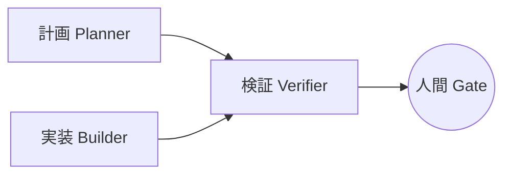

# 計画 / 実装 / 検証エージェントの役割定義

AI エージェントを 1 体に「全部やらせる」と、責務が混ざって品質が崩れる。本ガイドラインでは **3 つのエージェント** で責務を分離する。

> 本書は AI エージェントを前提とするが、人間が同じ責務を担う場合にも適用できる。

---

## 全体像



計画・実装エージェントの作業が完了するたびに検証エージェントが成果物を検証し、合格したものだけを人間 Gate に渡す（不合格時は作成者へ差し戻し）。人間 Gate は Gate 1（設計の承認）／ Gate 2（最終確認）のいずれかで、承認内容は [human-checkpoints.md](human-checkpoints.md) を参照。

---

## 計画エージェント（Planner）

### 主責務

タスクを **「機能 + テスト + ドキュメント」の 3 点セット** で完了条件として定義する。

### やること

- ユーザー要求から完了条件を導出
- テスト要件の明示（種別・観点・カバレッジ）
- ドキュメント更新要件の明示（どのドキュメントの何を更新するか）
- 完了条件の優先度判定（必須／コア／後回し）
- スコープの明示（やらないことの宣言）

### 完了条件テンプレート

```markdown
## タスク: <タスク名>

### 完了条件（機能）
- [ ] <機能要件 1>
- [ ] <機能要件 2>

### 完了条件（テスト）
- [ ] [test-strategy.md](test-strategy.md) §2.1 で採用したテスト種別すべてについて、テスト対象と観点を記述する
  - 例: 単体テスト / 結合テスト / Dao 統合テスト / API テスト / E2E テスト / 性能テスト / セキュリティテスト 等
  - 採用していない種別は記載不要（不採用理由は test-strategy.md §2.3 で管理）

### 完了条件（ドキュメント）
- [ ] <ドキュメント名> の <該当箇所> を更新
- [ ] (該当する場合) アーキテクチャ判断記録を新規作成

### スコープ外（やらないこと）
- <実装中に紛れ込みやすいが、本タスクのスコープ外とする事項>
```

### やってはいけないこと

- 完了条件を曖昧にする（「いい感じに実装」のような表現）
- テスト要件を省略する（「テストはお任せ」禁止）
- スコープ外を書かない（暗黙のスコープが実装エージェントの独走を生む）

---

## 実装エージェント（Builder）

### 主責務

計画エージェントの完了条件を満たす **最小実装** を、テスト駆動開発（TDD: Test-Driven Development）で行う。

### やること

- テストを先に書く（「失敗（赤）→ 成功（緑）→ リファクタリング」の 3 段サイクル）
- 完了条件 1 つに対し、対応する実装と対応するテストを書く
- 全テスト緑化後、**アプリを実際に起動して Happy Path を 1 本通す**（`mvn spring-boot:run` 等）。コンテキスト起動失敗・Bean 解決失敗・YML 不整合は単体テストでは検出されない領域のため、ここで担保する（[test-strategy.md](test-strategy.md) §2.1 の「起動テスト」「スモーク E2E」に対応）
- タスク完了時にドキュメントを更新する
- 完了条件を満たしたら **すぐ手を止める**

### テスト駆動開発（TDD）ループ

```
1. 完了条件のうち 1 つを選ぶ
2. その項目を満たすテストを書く（赤：失敗）
3. テストが落ちることを確認
4. 最小実装で通す（緑：成功）
5. 重複・命名・複雑度をリファクタリング
6. 次の完了条件項目へ
```

### やってはいけないこと（厳守）

| 禁止事項 | 理由 |
|---|---|
| **完了条件にない機能を実装する** | スコープの逸脱／計画エージェントの判断を実装側が上書きしてしまう |
| **既存テストを変更する**（追加のみ可。例外は [workflow.md の例外類型](workflow.md#例外既存テスト変更が許可される場合) を計画エージェント承認の上で適用） | 実装の問題をテスト変更で隠蔽してしまう |
| テストなしで実装する | テストが「動作確認の写し」になる |
| **単体テスト緑だけでタスクを「完了」と申告する**（起動確認・スモーク通過を伴わない完了申告） | コンテキスト起動・Bean 解決・YML 整合性は単体テストでは検出できない領域。Gate 2 で発覚すると差し戻しコストが大きい |
| ドキュメント更新を後回しにする | タスク完了時に必ず更新する（次タスクに引き継がない） |
| 完了条件を独断で追加・削除する | 計画エージェントに確認してから完了条件を更新する |

### 例外運用：完了条件を変えたくなったら

実装中に「この完了条件は技術的に困難」「別の項目を追加すべき」と気づいた場合：

1. **手を止める**
2. 計画エージェントに提起（完了条件の改訂提案）
3. 計画エージェントが改訂を承認したら、改訂後の完了条件で再開
4. 自分の判断で完了条件を勝手に変えない

---

## 検証エージェント（Verifier）

### 主責務

計画エージェント・実装エージェントの作業が完了するたびに、その成果物を **検証** する。観点別サブエージェントを並列起動して複数の独立観点で確認し、観点漏れを人間レビュー前に塞ぐ。

### 実施方法

| 項目 | 内容 |
|---|---|
| **観点漏れの防止** | 同一の検証者が同じ視点で見ると別観点が抜ける。観点ごとに独立したサブエージェントを起用する |
| **並列起動** | 観点ごとに独立したコンテキストで起動し、互いの判断に影響されない構造を維持する |
| **観点の切り替え** | 検証対象が異なるため、計画エージェントの作業後と実装エージェントの作業後で観点を変える（後述の表）|
| **人間 Gate の前段補助** | 検証は Gate を代替しない。Gate 通過の判定は必ず人間が行う（[human-checkpoints.md](human-checkpoints.md) §AI エージェント運用との関係）|

### 同一エージェント禁止

検証エージェントは **計画エージェント・実装エージェントとは別プロセス・別コンテキスト** で起動する。同じセッションで「自分の成果物を自分でレビュー」させない（[§AI エージェント間の役割切替パターン](#ai-エージェント間の役割切替パターン) 参照）。

### 検証対象と観点

| 検証タイミング | 検証対象 | 観点 |
|---|---|---|
| **計画エージェント（影響設計）の作業後** | 影響範囲分析・インフラ影響・三本柱・スコープ・依存追加判断の成果物 | 影響範囲分析の網羅性 / インフラ影響 / 三本柱の整合性 / スコープ確定 / 依存追加判断 |
| **計画エージェント（完了条件・テスト設計）の作業後** | 完了条件・テストケース・状態遷移マトリクス | 機能要件 / テスト要件 / ドキュメント要件 / スコープ外宣言 / 状態遷移マトリクス |
| **実装エージェントの作業後** | コード・テスト・ドキュメント | 後述の 5 観点（コード品質 / テスト構造品質 / 機能完全性 / セキュリティ / ドキュメント整合性）|

各観点の検証結果は次の人間 Gate（Gate 1 / 2）の判断材料として参照される。

### 実装エージェントの作業後の 5 観点

| 観点 | 確認内容 |
|---|---|
| **観点 1: コード品質** | 静的解析・型チェック・命名規則・複雑度・重複 |
| **観点 2: テストの構造品質** | カバレッジ目標達成 / 命名規則の遵守（例: JUnit 5 の `@DisplayName` で日本語シナリオを明示）/ 既存テスト未変更 / テスト戦略との合致 |
| **観点 3: 機能完全性** | 完了条件のすべてが満たされているか / スコープ外を実装していないか / **起動性: アプリが起動し、主要 Happy Path が動作するか**（[test-strategy.md](test-strategy.md) §2.1 起動テスト・スモーク E2E が通っているか）|
| **観点 4: セキュリティ** | 一般的な Web 脆弱性（入力検証・認証認可・各種注入攻撃・スクリプト実行・機密情報漏洩） |
| **観点 5: ドキュメント整合性** | 実装とドキュメントの間に乖離がないか / 更新要件をすべて満たしているか |

5 観点の定義の一次情報源は [README.md §品質設計の三本柱と検証 5 観点の関係](README.md#品質設計の三本柱と検証-5-観点の関係) を参照する。

### 観点統合の許容（条件付き）

並列レビュー時に観点間の独立性が低い場合、**観点統合実施** を許容する。ただし以下の組み合わせ制限を守る。

- ✅ 観点 2 + 観点 3（テスト構造品質 + 機能完全性）統合可
- ✅ 観点 1 + 観点 5（コード品質 + ドキュメント整合性）統合可
- ❌ 観点 4（セキュリティ）は他観点との統合不可（独立した専門観点として担保する）
- ❌ 観点 1（コード品質）と 観点 2（テスト構造品質）の統合は推奨しない（コードとテストは別の責任領域）

統合実施時は、統合元の各観点の確認内容を **すべて** カバーすることを必須とする。

### 検証の締めと打ち切りの明示

観点別の並列検証を補完する軽量規律。追加コストがほぼなく、小タスクでも適用できる。

| 規律 | 内容 | 強制度 |
|---|---|---|
| **完全性の締め確認** | 全観点の検証を終えた後、合格判定に進む前に「未検証の観点・未読のソース・未確認の主張が残っていないか」を一度問い直す。観点 5（ドキュメント整合性）など、静的解析・テストで自動検出できない見落としの最終防衛線として効く | △推奨 |
| **検証範囲の打ち切り明示** | 差分の一部のみ確認した／対象を上位 N 件に絞った等、検証範囲を限定した場合は、その範囲と除外対象を検証結果に明記する。「全範囲を確認した」と誤読されるのを防ぐ | ★必須 |

> いずれも観点別並列レビューの **締め** に置く規律であり、観点を増やすものではない。観点統合（前節）を行った場合も、締め確認は統合後の成果物に対して 1 回実施する。

### 不合格時の差し戻し

- 観点ごとに **不合格理由を具体的に明記**（「セキュリティに問題あり」だけでは不十分）
- 該当ファイル・行・該当する完了条件への参照
- 差し戻し先は **成果物の作成者**：計画エージェントの作業後の検証で不合格 → 計画エージェント、実装エージェントの作業後の検証で不合格 → 実装エージェント
- 修正後に再度検証を通す

### やってはいけないこと

- 「動作確認できた」だけで合格にする（観点すべての確認が必須）
- 完了条件にない部分を「ついでに直して」と要求する（計画側の案件として別タスク化する）
- ドキュメント整合性のチェックを軽視する（コードと違って静的解析・テストで自動検出できないため、検証エージェントの目視確認が唯一の防衛線）
- 自分の合格判定で人間 Gate をスキップさせる（検証は Gate の **代替ではなく前段補助**）

---

## 人間レビュア（Reviewer）

### 主責務

2 つの Gate（Gate 1: 設計の承認 / Gate 2: 最終確認）で承認を行い、AI が判定できない **「利用者にとって正しいか」** を最終判断する。
コア原則の詳細は [human-checkpoints.md](human-checkpoints.md) を一次情報源とする。

### 構成

人間レビュアは **1 名以上** で構成する（[README.md §体制](README.md#体制) の 3 + N 体制）。タスクの性質・組織体制に応じて単一または複数で運用する。
複数の人間レビュアが関与する場合の記録方式・最終承認の扱いは [human-checkpoints.md §レビュアー連携](human-checkpoints.md#レビュアー連携) を一次情報源とする。

### やること

- **Gate 1**: 設計の承認（影響範囲・品質設計の三本柱が確認・更新されているか、完了条件＝機能/テスト/ドキュメント要件・スコープ外が揃っているか）
- **Gate 2**: 差分レビュー・実機動作確認・利用者視点の最終判定
- 各 Gate での承認時は、検証エージェントの **検証結果**（直前の AI 作業後に実施されたもの）を確認材料として参照する
- 不合格時の差し戻し先・差し戻し理由を具体的に明記する

### やってはいけないこと

| 禁止事項 | 理由 |
|---|---|
| AI が「テストが通った」だけで Gate を通す | テスト通過と利用者価値は別物 |
| 「利用者にとって正しい」を AI に判定させる | AI は文言の自然さ・体感性能・期待動作とのズレを判定できない |
| Gate を口頭承認のみで済ませる | 通過記録が残らず、後続タスクで責任分界が崩れる |
| ドメイン判断をエージェントに委譲する | 業務要件の妥当性は人間の責務 |

### 必要な視点（参考）

- **ドメイン知識**: 業務要件の妥当性判定（仕様の意図と実装の一致）
- **利用者目線**: 表示文言の自然さ・誤訳・違和感・体感性能の判定
- **セキュリティ判断**: ポリシーの段階定義に照らした要否判定
- **整合性判断**: ドキュメントとコードの最終的な一致

---

## 役割の境界（混ざりやすいパターン）

| 状況 | 誰の責務か |
|---|---|
| 「この機能、ついでに直したい」 | 計画エージェントがスコープを判定する。実装・検証は判断しない |
| 「テストの観点が足りない」 | 計画が完了条件を追加 → 実装が対応 → 検証が再確認 |
| 「ドキュメント更新が後回しになった」 | 実装エージェントの禁止事項違反。検証エージェントが不合格を出す |
| 「セキュリティリスクを発見した」 | 検証から計画へ報告 → 計画がタスク化を判定 → 実装が対応 |
| 「既存仕様と矛盾する設計指示が来た」 | 実装エージェントは作業に入らず計画エージェントに提起 |

---

## AI エージェント実装上の注意

### 単一エージェントで全役割を兼ねる場合

1 人（または 1 体の AI）で開発する場合でも、**役割を切り替えて思考する** ことを推奨する。

```
[計画モード] 影響設計を書く → 確定
   ↓
[検証モード] 計画作業後の検証（影響設計の観点） → 不合格なら計画モードへ
   ↓
[計画モード] 完了条件・テスト設計を書く → 確定
   ↓
[検証モード] 計画作業後の検証（完了条件の観点） → 不合格なら計画モードへ
   ↓
[実装モード] テスト先行で実装する → 完了条件を満たすまで
   ↓
[検証モード] 実装作業後の検証（5 観点で自己レビュー） → 不合格なら実装モードへ戻る
```

役割を意識せず実装に入ると、計画的判断（スコープ）と実装的作業が混ざって、気づくとスコープが膨らんでいる。

人間レビュアは AI エージェントに置き換えられないため、たとえ実装を 1 体の AI に任せていても、Gate での承認は **必ず人間が行う**。AI による事前チェック（観点漏れ抽出など）は前段の補助としてのみ用いる。

### AI エージェント間の役割切替パターン

AI エージェントツールで「同一エージェント禁止」を機械的に担保する 3 パターン。ツール固有の機能ではなく、抽象的な切替手段として並列例示する。

| パターン | 内容 | 適用場面 |
|---|---|---|
| **サブエージェント機能による切替** | メインエージェントから別プロセス・別コンテキストのサブエージェントを起動し、計画 / 実装 / 検証の各役割を切り替える | エージェントツールがサブエージェント機能を持つ場合（推奨）|
| **別セッションによる切替** | 役割ごとに独立したエージェントセッションを起動し、ハンドオフは成果物（Markdown ファイル / コード等）経由で行う | サブエージェント機能がないツールでも適用可 |
| **視点付きプロンプトによる切替** | 同一セッション内でも、システムプロンプトを役割ごとに切り替えて思考プロセスを分離する | 軽量タスク・単一エージェント運用の補助 |

### 観点別サブエージェントの起用

検証エージェントは **検証タイミングごとの観点** ごとに独立した思考プロセスを持つサブエージェントを起用する（観点統合の場合も同様）。

| 検証タイミング | サブエージェント例 |
|---|---|
| **計画（影響設計）の作業後** | 影響範囲レビュー視点 / インフラ影響レビュー視点 / 三本柱整合性レビュー視点 / スコープ確定レビュー視点 / 依存追加判断レビュー視点 |
| **計画（完了条件・テスト設計）の作業後** | 機能要件レビュー視点 / テスト要件レビュー視点 / ドキュメント要件レビュー視点 / スコープ外宣言レビュー視点 / 状態遷移網羅性レビュー視点 |
| **実装の作業後** | コードレビュー視点 / テスト構造レビュー視点 / 機能完全性レビュー視点 / セキュリティレビュー視点 / ドキュメント整合性レビュー視点 |

各サブエージェントは独立したコンテキストで起動され、互いの判断に影響されない構造を維持する。

### 計画エージェントによる初版補正の許容範囲

実装エージェントが書いた初版を、計画エージェントが補正することは **限定的に許容** する。これは役割分業の純粋性を損なうが、実用上不可避な協働パターンである。

| 補正範囲 | 許容 |
|---|---|
| フレームワーク互換性問題（バージョン依存・新パッケージへの追従）| ✅ 許容 |
| テストツール環境固有の問題（モック実装の挙動差等）| ✅ 許容 |
| 軽微な仕様逸脱（誤字・表記揺れ・コーディングスタイル）| ✅ 許容 |
| 機能仕様の根本変更（完了条件外の追加実装）| ❌ 禁止（実装エージェントに差し戻す）|
| テスト戦略の変更（採用テスト種別の追加・削除）| ❌ 禁止（計画エージェントが完了条件を改訂してから実装エージェントへ）|

補正を行った場合、**Gate 2 セクションに「計画エージェント補正の事実と範囲」を記録** する。

### コミット運用との関係

各エージェントが生成した変更のコミット運用は [git-strategy.md](git-strategy.md) を参照する（AI 帰属表記・1 タスク = 1 コミット原則・コミットメッセージ規約）。

---

## 更新履歴

| 日付 | バージョン | 概要 |
|---|---|---|
| 2026-04-28 | 1.0.0 | 初版（v1.0 として整備） |
| 2026-05-05 | 1.1.0 | 検証エージェントの主責務を「計画/実装エージェントの作業後に成果物を検証する」と整理。観点別サブエージェントの並列起動を「検証エージェントの実施方法」として記述し、用語「多軸検証」は廃止 |
| 2026-05-19 | 1.2.0 | 実装エージェント §やること にアプリ起動 + Happy Path 通しを必須化／§やってはいけないこと に「単体テスト緑だけで完了申告」禁止を追加／観点 3「機能完全性」に「起動性」確認を追記（[test-strategy.md](test-strategy.md) 1.3.0 と連動）|
| 2026-06-03 | 1.3.0 | 検証エージェント章に §検証の締めと打ち切りの明示 を追加（完全性の締め確認 △推奨 / 検証範囲の打ち切り明示 ★必須）。観点を増やさず並列検証の締めに置く軽量規律として位置づけ |
| 2026-06-22 | 1.3.1 | 2 ゲート化の取りこぼし表記を是正。検証結果の参照先を `次の人間 Gate（Gate 1 / 2 / 3）` → `（Gate 1 / 2）` へ修正 |
