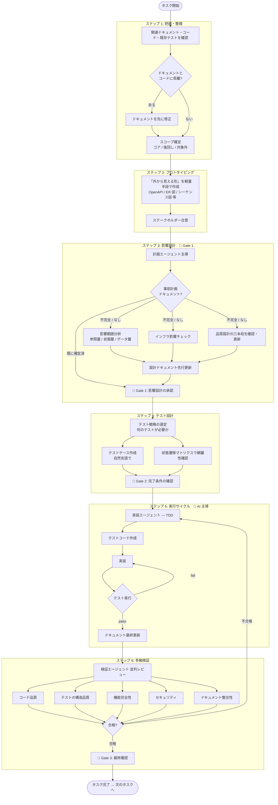

# タスクサイクル ワークフロー

本ガイドラインの **唯一のタスク進行サイクル**。すべての開発タスクを **同じ 6 ステップ** で進める。

---

## 全体フロー

---

## ステップ 1：把握・整理

**狙い**: タスクのスコープを確定し、既存資産との関係を整理する。

### やること

- タスクのユーザー要求から **解決すべき課題** を 1 行で明文化する
- 関連する既存資産を確認する
  - 関連ドキュメント（API 仕様書／状態遷移図／データモデル図／アーキテクチャ判断記録（ADR: Architecture Decision Record））
  - 関連コード
  - 関連既存テストケース
- ドキュメントとコードの整合を確認する（乖離があれば本タスク前に解消する）
- スコープを **コア／後回し／対象外** の 3 区分で確定する

### スコープ確定のテンプレート

| 区分 | 内容 |
|---|---|
| コア | 本タスクで必ず実装する |
| 後回し | 後続タスクで実装する（理由を明記） |
| 対象外 | 実装しない（混入しそうだが今回はやらない事項） |

### 完了条件

- [ ] タスクが解決する課題が 1 行で明文化されている
- [ ] 関連既存資産（ドキュメント・コード・テスト）を把握済み
- [ ] ドキュメントとコードに乖離がない（あれば解消済み）
- [ ] スコープが 3 区分で確定している

---

## ステップ 2：プロトタイピング

**狙い**: 実装前に「外から見える形」を確認し、認識ズレを早期に潰す。

### やること

- 「外から見える形」を軽量な手段で先に作り、ステークホルダーと確認する
- ステークホルダーから「この方向で進める」合意を得る
- 該当しないタスクは「該当なし」を宣言（形式的スキップは禁止）

### プロトタイピング手段の例

タスクの性質に応じて軽量な手段を選ぶ。

| タスク種別 | プロトタイピング手段の例 |
|---|---|
| **API 追加・変更** | OpenAPI 定義（リクエスト・レスポンス例）／スタブサーバーで応答確認 |
| **データモデル変更** | ER 図／サンプルデータ（CSV / JSON 等） |
| **バッチ・非同期処理** | 入出力例の文書化／処理フロー図 |
| **外部連携追加** | 連携シーケンス図／モック応答例 |
| **画面・UI 変更（該当する場合）** | 静的ページ／ノーコードツール／デザインツール |

### 完了条件

- [ ] 「外から見える形」がプロトタイプとして提示されている
- [ ] ステークホルダーが方向性に合意した
- [ ] 該当しないタスクの場合、その旨を宣言している

> 軽微な内部改修などプロトタイプ不要なタスクでも、本ステップを **形式的にスキップせず**、「該当なし」を記録する。チェックリストを回した証跡が次タスク以降の判断材料になる。

---

## ステップ 3：影響設計（★Gate 1）

**狙い**: 影響範囲とインフラ影響を機械的に洗い出し、品質設計を確認・更新する。

> 本ステップは **Gate 1**（通過判定点 1）。人間が必ず承認する。詳細は [human-checkpoints.md](human-checkpoints.md)。

### 3.1 入力の確認 — 事前計画ドキュメントとの対応

タスク開始時に **事前計画ドキュメント**（プロジェクト計画書 / 設計書 / 仕様書 / 課題管理ツールのチケット / 計画ツールの成果物 等）が既に存在する場合、本ステップで再度全項目を埋め直す必要はない。

| 状況 | 運用 |
|---|---|
| 事前計画ドキュメントで影響範囲・三本柱・スコープが **既に確定済** | タスク 1 md の `## Gate 1` セクションは **事前計画への参照リンクのみ** で成立可（重複記載不要） |
| 事前計画ドキュメントが **不完全**（一部の判断のみ確定） | 確定済の判断は参照、未確定部分のみ Gate 1 で補完 |
| 事前計画ドキュメントがない | §3.2〜§3.4 でフル分析を実施 |

> **注意**: 事前計画ドキュメントを参照のみで済ませる場合でも、**Gate 1 の通過記録（承認者・承認日）は必須**。`## Gate 1` セクションは「§3.2〜3.4 はすべて事前計画 [リンク] §X.Y で確定済」と記載し、形式を保つ。

### 3.2 影響範囲分析

[impact-analysis.md](impact-analysis.md) の手順に従い、変更属性チェックを通したうえで、該当する層を詳細分析する。

| 層 | 対象 | 主な見落としリスク |
|---|---|---|
| **参照層** | 型・関数・定数の使用箇所 | 実行時の破損 |
| **状態層** | ステートマシンの矛盾 | データ破損 |
| **データ層** | 既存データへの影響 | 本番不整合 |

### 3.3 インフラ影響チェック

[infra-impact-checklist.md](infra-impact-checklist.md) の項目を順にチェックする。

主項目：
- 大量データ処理のタイムアウト
- 新規外部サービス連携
- データストアのスキーマ変更と移行戦略
- バッチ・非同期処理の追加
- 依存ライブラリの新規追加判断（J.1）

### 3.4 品質設計の確認・更新（三本柱）

品質設計の三本柱を確認し、必要があれば更新する。

| 柱 | 参照テンプレート | 確認内容 |
|---|---|---|
| **テスト戦略** | [test-strategy.md](test-strategy.md) | 本タスクで適用する戦略・採用しないテストの理由が明確か |
| **セキュリティ方針** | [security-policy.md](security-policy.md) | 段階定義に沿うか・本タスクで強化が必要か |
| **ドキュメント計画** | [document-plan.md](document-plan.md) | 本タスクで更新するドキュメントが特定できているか |

### 3.5 設計ドキュメント更新

影響範囲分析・インフラ影響・品質設計の結果に基づき、関連ドキュメントを **実装前に** 更新する。

- アーキテクチャ判断記録が必要な技術判断があれば新規作成する
- 状態遷移図・データモデル図に変更点を反映する（差分が明確になる形で）

### Gate 1：人間の承認

- 影響範囲・方針が妥当か
- 品質設計の三本柱が確認・更新されているか
- 「影響範囲分析の特定の層が漏れていないか」を質問形式で確認する

---

## ステップ 4：テスト設計

**狙い**: 実装前に「何のテストが必要か」を確定する。

### やること

- テストケースを **自然言語で記述** する（コードに落とす前）。例：「ステータスが下書きの注文に対し、提出操作を行うと承認待ちになる」のように、操作と期待結果を一文で記す
- **状態遷移マトリクス** を使って網羅性を担保する
- 既存テストケースとの重複・補完関係を整理する

### 状態遷移マトリクスの形式（例）

| 遷移元 ＼ 遷移先 | 下書き | 承認待ち | 公開済 | 取下 |
|---|---|---|---|---|
| 下書き | - | 許可（提出） | 禁止 | 許可（取下） |
| 承認待ち | 禁止 | - | 許可（承認） | 許可（取下） |
| 公開済 | 禁止 | 禁止 | - | 禁止 |
| 取下 | 許可（差戻） | 禁止 | 禁止 | - |

新しい状態を追加する場合、**この行と列を埋める** ことで考慮漏れを防ぐ。マトリクスの埋め方ルール・到達不能/離脱不能チェック等の詳細手順は [impact-analysis.md の状態層](impact-analysis.md#状態層状態遷移分析) を一次情報源とする。

### 完了条件

- [ ] テストケースが自然言語で列挙されている
- [ ] 状態遷移マトリクスで網羅性が確認されている（状態を扱うタスクの場合）
- [ ] 既存テストとの重複・補完が整理されている

---

## ステップ 5：実行サイクル（△Gate 2）

**狙い**: 計画 → 実装 → 検証の小さなサイクルを回し、「機能 + テスト + ドキュメント」の 3 点セットでタスクを完成させる。

> **Gate 2 のタイミング**: ステップ 4（テスト設計）完了後・ステップ 5 開始前（＝実装エージェントが作業に入る前）。詳細は [human-checkpoints.md](human-checkpoints.md)。

### 役割分担（[roles.md](roles.md) 参照）

- **計画エージェント**：完了条件を定義する
- **実装エージェント**：テスト先行で実装する
- **検証エージェント**：完了条件チェック・観点別レビュー

### 完了条件テンプレート

完了条件は **「機能 + テスト + ドキュメント」の 3 点セット** ＋ **スコープ外宣言** で構成する。

具体的なテンプレート本体は [roles.md の計画エージェント章](roles.md#計画エージェントplanner) を一次情報源とする。

### テスト先行ループ（テスト駆動開発：TDD = Test-Driven Development）

「テスト失敗（赤）→ 最小実装で成功（緑）→ リファクタリング」の 3 段サイクルを繰り返す。

詳細な 6 段サイクル手順は [roles.md の実装エージェント章](roles.md#実装エージェントbuilder) を一次情報源とする。

### 厳守ルール

> **既存テストは原則として変更せず、新規テストの追加のみを許容する。**

理由：既存テストを変更すると、実装の問題（既存仕様との不整合）が **テストの変更で隠蔽** される。既存テストを変えたくなったら、それは設計の見直しサイン。

#### 例外（既存テスト変更が許可される場合）

下記いずれも、**計画エージェントの承認** を経て初めて変更可能。実装エージェントが独断で「明らか」と判定して変更してはならない。

| 例外類型 | 判定主体 | 必須記録 |
|---|---|---|
| 既存テスト自体に **バグ** があった（仕様と一致していない） | 計画エージェント | バグ内容と修正前後の差分をコミットメッセージに明記 |
| **仕様変更が承認済み** で、既存仕様自体が変わった | 計画エージェント（ドキュメント更新済み） | 変更承認の根拠（議事メモ等）への参照 |
| **リファクタによる API シグネチャ変更**（仕様は不変） | 計画エージェント | 変更前後の呼び出し例とシグネチャの対比、仕様不変の確認 |
| **テストフレームワーク／ライブラリの破壊的変更追従** | 計画エージェント | 移行ガイド・公式リリースノートへの参照 |

判定に迷う中間ケース（テスト名の改善・アサーション粒度の調整等）は、原則として **新規テストの追加で代替** し、既存テストは変更しない。

---

## ステップ 6：多軸検証（★Gate 3）

**狙い**: 5 つの観点を **並列に** 検証し、観点の抜けを防ぐ。

> 本ステップは **Gate 3** を含む。人間が必ず最終確認する。詳細は [human-checkpoints.md](human-checkpoints.md)。

### 5 つの検証観点

5 観点の定義は [README.md §品質設計の三本柱と多軸検証の 5 観点の関係](README.md#品質設計の三本柱と多軸検証の-5-観点の関係) を一次情報源とする。
各観点の確認内容・主な担当の詳細は [roles.md の検証エージェント章](roles.md#検証エージェントverifier) を参照。

### 並列実行のメリット

- 複数の検証者が同じ観点ばかり見て別観点が抜ける問題を回避できる
- 1 ラウンドで全観点をカバーできる
- AI エージェントを 5 並列で動かして高速化できる

### Gate 3：人間の最終確認

- 差分レビュー
- 動作確認（実機・実環境）

AI と人間の判断境界（「テストが通った」と「利用者にとって正しい」の違い）の詳細は [human-checkpoints.md コア原則](human-checkpoints.md) を一次情報源とする。

---

## タスク完了時のチェック

タスクを完了とする前に、以下が揃っていることを確認する。

- [ ] コード（テスト網羅・カバレッジ目標達成）
- [ ] テスト（戦略に基づいた適切な種別・既存テスト未変更）
- [ ] 関連ドキュメント（API 仕様書／状態遷移図／データモデル図 等）が更新済み
- [ ] アーキテクチャ判断記録（技術判断があった場合）
- [ ] Gate 1・Gate 2・Gate 3 がすべてタスク 1 md に通過記録として残っている
- [ ] スコープ外の項目に手を出していない

---

## よくある失敗

| 失敗パターン | 起きるステップ | 予防策 |
|---|---|---|
| 「動くもの優先」で品質設計を後回し | ステップ 3 を軽視 | Gate 1 を必ず通す |
| ドキュメントを最後にまとめて書く | ステップ 5 終盤 | タスク完了条件にドキュメント更新を含める |
| 影響範囲漏れ | ステップ 3 | 影響範囲分析を必ず実施 |
| インフラ未考慮（タイムアウト等） | ステップ 3 | インフラ影響チェックリスト |
| AI が完了条件にない機能を勝手に作る | ステップ 5 | 実装エージェントの禁止事項として明記 |
| テストが「動作確認の写し」になる | ステップ 5 | テスト戦略の品質特性に紐づくか検証エージェントが確認 |
| テストの歪曲（既存テストを書き換えて緑化） | ステップ 5 | 既存テスト変更禁止ルール |
| 設計スコープ被り（複数のタスクが同じ箇所を同時改修して衝突する） | ステップ 3 | ドキュメント正規化（一次情報源） |
| ドキュメント腐朽 | ステップ 6 | 静的解析・テストで自動検出できないため、検証エージェントが必ず目視確認 |

---

## 適用例：「ステータスに『承認待ち』を追加する」

| ステップ | アクション |
|---|---|
| 1 | 既存の状態遷移図・ステータス列挙型・関連 API 仕様を把握。スコープ確定 |
| 2 | 画面表示変更を伴うため、モックアップで利用者目線を確認 |
| 3 | 参照層：ステータス列挙型の全使用箇所を抽出／状態層：状態遷移図を更新／データ層：既存「下書き」レコードの移行戦略／インフラ：バッチ実行時のロック戦略 |
| 4 | 状態遷移マトリクスで「承認待ち」の行・列を埋める |
| 5 | テスト先行で実装。既存遷移テストは変更しない |
| 6 | 5 観点並列検証。特にドキュメント整合性を重点確認 |

---

## 更新履歴

| 日付 | 版 | 変更者 | 内容 |
|------|----|-------|------|
| 2026-04-28 | 1.0.0 | ioiso | 初版（v1.0 として整備） |
