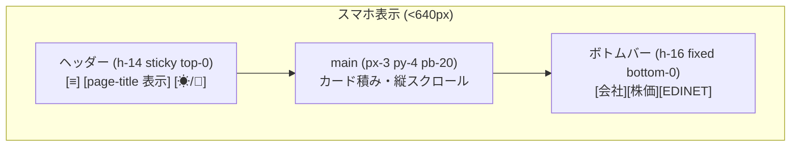
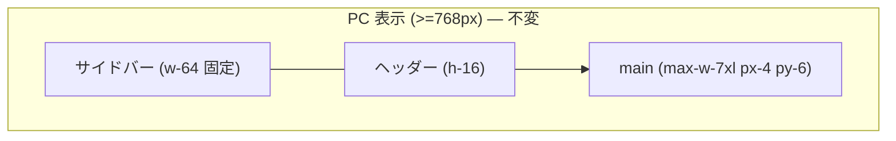

# Task T20260502: スマホ向け UI 刷新（v3 全 5 画面 / sm 未満）

- 着手日: 2026-05-02
- 完了日: -
- 担当: iori-oiso（計画）+ Claude Code（実装・検証）
- 関連リンク:
    - 画面刷新マスタープラン: [T20260429-screen-renewal-htmx-tailwind.md](T20260429-screen-renewal-htmx-tailwind.md)
    - ADR: [ADR-001-screen-renewal-stack.md](../adr/ADR-001-screen-renewal-stack.md)
    - Phase 8 スナップショット: [T20260429-screen-renewal-phase8-playwright.md](T20260429-screen-renewal-phase8-playwright.md)

---

## 1. 把握・整理（ステップ 1）

### 解決すべき課題（1 行）

**v3 系 5 画面が PC を主視点に作られており、スマホ（sm 未満 / iPhone 相当）で読みづらい・操作しにくい状態を、「テーブル → カード化 + ボトムバーナビ」の 2 軸で刷新する。**

### スコープ確定

| 区分 | 内容 |
|---|---|
| **コア（必ず実装）** | (a) `layout-v2` のスマホヘッダー / ボトムバー（**4 タブ**） / `<h1>` 表示復活 / `pb-20 sm:pb-0`<br>(b) **テーブル → カード化のプロトタイプを 1 箇所先行作成**（候補: `index-table.html` または `valuation-table.html` の `stock-table`）し、**実機相当のスクショ + DOM 確認をもって Gate 1 内で「他 11 箇所への適用可否」を再判断**する。「全 12 箇所カード化」は **暫定スコープ**（プロトタイプ判断後に確定）<br>(c) `corporate-v2` のタブを横スクロール化 + Chart 高さを `h-48 sm:h-64` に圧縮（カード化対象であるサブテーブル 6 件は (b) のプロトタイプ判断に従う）<br>(d) ソート UI のスマホ向けフォールバック（カード上部に「並び替え」ドロップダウン）<br>(e) Playwright スナップショット `mobile` ケース（375x812）の **PNG ビジュアルリグレッション採用**（baseline 保存 + 差分検出 + DOM 構造アサーション併用）|
| **後回し** | • `prefers-reduced-motion` / アニメーション最適化（次タスク）<br>• タッチ操作向けスワイプ・プルリフレッシュ（次タスク）<br>• PWA / オフライン対応（対象外と性質が近いが、需要が出てから）|
| **対象外** | • 旧 v1 / v2 テンプレートの修正（既に廃止予定）<br>• PC 向け UI（sm 以上）の挙動変更（既存 PC レイアウトは不変）<br>• Controller / Presenter / DAO / Java 側の変更（テンプレート + Tailwind だけで完結させる）<br>• `application.yml` / `release/*` の変更（環境設定はスコープアウト方針に従う）<br>• 新規 **ランタイム** ライブラリ追加（既存 Tailwind / Alpine / htmx / Lucide のみで実装）。**ただし PNG ビジュアルリグレッション用に Playwright Java の組込み機能（`assertThat(page).hasScreenshot()` 等）の利用は許容**（既存の Playwright Java 依存内で実装可能なため新規依存は発生しない）|

### ドキュメント・コードの乖離

- 乖離なし。CLAUDE.md / マスタープラン T20260429 ともに「Phase 1〜8 完了済」と整合し、本タスクは Phase 8 後の「モバイル特化 Phase 9」相当と位置付けられる。

---

## 2. プロトタイピング（ステップ 2）

### 採用手段：本 md 内の構造図（mermaid）+ 主要画面のレイアウトワイヤー（テキストモック）

実装前にレビュアーが「外から見える形」を確認できることを目的とし、Figma 等の外部ツールは使用しない（リポジトリ完結 / Git 履歴に残る形式を優先）。

### 2.1 全体レイアウト（モバイル / sm 未満）





### 2.2 テーブル → カード化（共通パターン）

#### Before（現状: 横スクロールのみ）

```
┌─────────────────────────────────────┐
│ コード │ 会社名 │ 提出日 │ 企業価値 │ 変動 │ 株価 │ ...   │← 横スクロール必須
└─────────────────────────────────────┘
```

#### After（提案: sm 未満カード化）

```
┌──────────────────────────────────┐
│ ▼ 並び替え: 証券コード ↑          │  ← <select> + sort 反映
├──────────────────────────────────┤
│ 9999  サンプル株式会社  ⌕ →      │  ← 主キー行（タップで詳細遷移）
│ 提出日       2025-01-01           │
│ 最新企業価値  1,234.56             │
│ 株価平均      980 (-5.4%)          │
│ 変動係数      0.12                 │
│ [詳細を見る]                       │
├──────────────────────────────────┤
│ 9998  ...                          │
└──────────────────────────────────┘
```

実装方式: `<table class="hidden sm:table">` + `<div class="block sm:hidden">` の 2 系統を fragment 内で並列配置。データソースは同じ `table.companies()` / `table.rows()` を 2 度ループする。

### 2.3 ソート UI のフォールバック

スマホでは `<th>` クリックが消えるため、カードリスト上部に下記を配置する。

```html
<div class="flex items-center gap-2 sm:hidden">
  <label class="text-xs text-slate-500" for="sort-select">並び替え</label>
  <select id="sort-select"
          class="rounded border ..."
          hx-get="@{/v3/index/table(...)}"
          hx-target="#index-table"
          hx-trigger="change"
          hx-push-url="true"
          name="sort">
    <option value="code,asc">証券コード ↑</option>
    <option value="code,desc">証券コード ↓</option>
    <option value="latestCorporateValue,desc">企業価値 ↓</option>
    ...
  </select>
</div>
```

選択中の `sortParam` は `th:selected` で復元する。

### 2.4 ボトムバー（4 タブ）

```html
<nav aria-label="モバイルナビ"
     class="fixed bottom-0 inset-x-0 z-20 flex h-16 border-t bg-white sm:hidden ...">
  <a href="@{/v3/index}"        ...>会社</a>
  <a href="@{/v3/valuation}"    ...>株価</a>
  <a href="@{/v3/edinet-list}"  ...>EDINET</a>
  <a href="..."                 ...>銘柄</a>  <!-- ← 銘柄詳細 (4 タブ目) -->
</nav>
```

- `aria-current="page"` で現在ページをハイライト（青系）
- 既存サイドバーは sm 以上で表示維持、sm 未満ではドロワー（既存ハンバーガー）も併存（多階層メニュー対応）。ボトムバーは「主要 4 画面の最短到達」、ドロワーは「将来追加項目」。

#### 銘柄詳細タブの遷移先方針（**Gate 1 で要判断**）

`/v3/corporate` は `code` パラメータが必須であり、ボトムバーから直接 1 タップで開ける「ホーム」が無い。以下 3 案から方針を確定する。

| 案 | 内容 | メリット | デメリット |
|---|---|---|---|
| **A. 直近銘柄を localStorage に保存** | `/v3/corporate?code=XXX` を開いた時点で `localStorage('fundanalyzer.lastViewedCode')` に保存。ボトムバーの「銘柄」リンクは `<a href="@{/v3/corporate(code=...)}">` を Alpine.js で動的に書き換え。未保存時は `/v3/index` にフォールバック | 「直前見ていた銘柄に戻れる」UX。クッキー/サーバー状態不要 | 初回利用時はリンク先が `/v3/index` になり、4 タブ目の意味が薄れる |
| **B. お気に入りトップに飛ぶ** | `/v3/index?target=favorite` の最上位 `code` をボトムバー描画時に Presenter で解決し `<a th:href>` で埋める。お気に入りが空なら `/v3/index` にフォールバック | サーバーのみで完結、JS 不要 | Presenter / ViewModel に手を入れる必要が出るため **「Java 側を触らない」スコープと衝突**（要再判断） |
| **C. ボトムバー 4 タブ目はランディング画面用「銘柄を選ぶ」リンク** | ボトムバー「銘柄」をタップすると `/v3/index` の検索 input に focus が当たる専用画面に飛ぶ（実体は index でも可、フラグメント遷移 `#search-focus` で input に scroll-into-view + focus） | Java 側不変。直感的 | 「銘柄詳細を直接出す」UX 期待からはズレる |

**推奨**: **案 A**（localStorage + JS フォールバック）。Java 側を触らないスコープを守れて、UX 上「直前の銘柄に戻る」体験が得られる。Gate 1 で承認されれば §3 / §5 に正式に組み込む。

### 2.5 corporate-v2 の Chart 高さ・タブ

- 14 個の Chart `h-64` → `h-48 sm:h-64`
- 6 タブの `flex-wrap` → `overflow-x-auto whitespace-nowrap` + 横スクロールバー（`scrollbar-thin` クラスは Tailwind プラグイン無しでも `[&::-webkit-scrollbar]:h-1` 等で対応）

### ステークホルダー合意

- 認識合わせ済（AskUserQuestion 4 問・2026-05-02）
    - 対象画面: v3 全 5 画面
    - UI 方針: テーブル → カード化 + ナビをドロワー/ボトムバー化
    - 進め方: デザイン提案 → レビュー → 実装
    - ブレークポイント: Tailwind sm 未満（<640px）

---

## 3. 影響設計（ステップ 3 / Gate 1）

### 3.1 影響範囲分析

#### 参照層（型・関数・定数の使用箇所）

| 対象 | 影響 | 備考 |
|---|---|---|
| `layout-v2.html` | **改修** | ヘッダーの `<h1 class="hidden md:block">` を `block` 化 + **4 タブ ボトムバー追加** + `<main>` の下 padding 調整 + 銘柄詳細リンクの localStorage 復元 JS（案 A 採択時）|
| `templates/index-v2.html` | 改修なし（ホスト側） | ただしソート select を増設するため `<input search>` 直下に追加 |
| `fragments/index-table.html` | **改修（プロトタイプ第 1 候補）** | desktop table + mobile card の 2 系統。Phase B0 で先行プロトタイプを作り、Gate 1 内で他 fragment への展開可否を判断 |
| `templates/valuation-v2.html` | 改修なし（ホスト側） | ソート select を view ごとに対応（5 view × 異なる列）|
| `fragments/valuation-table.html` | **改修候補（プロトタイプ判断後に確定）** | 5 view 全部にカード化を適用予定（`stock` / `submit` / `graham-index` / `dividend-yield` / `industry`）。判断結果に応じて view 単位でスコープ調整 |
| `templates/edinet-list-v2.html` | 改修なし（ホスト側） | 同上 |
| `fragments/edinet-list-table.html` | **改修候補（プロトタイプ判断後に確定）** | 9 列が一番タフ。カードでは「提出日 + 統計サマリ + ID 群を折りたたみ」予定 |
| `templates/edinet-list-detail-v2.html` | **改修候補（プロトタイプ判断後に確定）** | 8 列の処理状況サマリテーブル → カード（`dl` リスト）化予定 |
| `fragments/edinet-document-card.html` | **改修候補（プロトタイプ判断後に確定）** | 10 列メタテーブル → カード化、書類ファイル外部リンクは現状の `dl` を維持 |
| `templates/corporate-v2.html` | **改修** | (a) Chart 高さ `h-48 sm:h-64`（確定）<br>(b) その他情報タブを横スクロール（確定）<br>(c) 6 サブテーブルのカード化はプロトタイプ判断後に確定 |
| Java / Controller / Presenter / Record | **不変** | UI 専用タスクなのでサーバー側は触らない（銘柄詳細ボトムバーは案 A 採択により localStorage 解決のみ）|
| `application.yml` / `release/*` | **不変** | スコープ外 |
| `package.json` / `package-lock.json` | **不変** | 既存ライブラリのみで実装 |
| Playwright `Phase8ScreenSnapshotTest` | **改修** | (1) **PNG ビジュアルリグレッション採用**: `assertThat(page).hasScreenshot("<screen>-<viewport>.png")` 等で baseline と比較<br>(2) DOM 構造アサーション: `nav[aria-label="モバイルナビ"]` 可視 / プロトタイプ採用後は `[data-mobile-card]` 存在 / `<table>` の `hidden` を assert<br>(3) baseline は `src/test/resources/playwright-baselines/` 配下に追加（`target/` は CI で揮発するため不可）|

#### 状態層（ステートマシン）

該当なし。本タスクで扱うのは **表示の表現（CSS class / HTML 構造）のみ** であり、画面遷移・ドメイン状態には触らない。

#### データ層（既存データへの影響）

該当なし。スキーマ変更・マイグレーション無し。

### 3.2 インフラ影響チェック（[infra-impact-checklist.md](../guideline/infra-impact-checklist.md) 準拠）

| 項目 | 結果 |
|---|---|
| 大量データ処理のタイムアウト | 影響なし（クライアント表現のみ） |
| 新規外部サービス連携 | なし |
| データストアのスキーマ変更と移行戦略 | なし |
| バッチ・非同期処理の追加 | なし |
| 依存ライブラリの新規追加判断（J.1） | **追加なし**（Tailwind / Alpine / htmx / Lucide で完結） |
| ビルドパイプライン（frontend-maven-plugin） | 影響なし。`npm run build` の出力先・成果物名も変更なし |
| jar サイズ | 数 KB 程度の HTML / Tailwind ユーティリティ追加のみ。実害なし |

### 3.3 品質設計の三本柱

#### テスト戦略（[test-strategy.md](../guideline/test-strategy.md) 準拠）

| 種別 | 採否 | 内容 |
|---|---|---|
| 単体テスト（Service / Util） | **不採用** | サーバー側を変更しないため対象なし |
| 統合テスト（Controller MockMvc） | **不採用** | 同上 |
| Playwright スナップショット（DOM アサーション） | **採用** | `Phase8ScreenSnapshotTest` の mobile ケース（375x812）に **DOM 構造アサーション** を追記:<br>• `aside`（サイドバー）が `-translate-x-full` で非可視（既存どおり）<br>• `nav[aria-label="モバイルナビ"]`（**新設 4 タブ ボトムバー**）が可視 / 4 件のリンクが存在 / 現在ページに `aria-current="page"`<br>• プロトタイプ判断後にカード化が確定した fragment では `[data-mobile-card]` が `>=1` 件存在 / 元の `<table>` が `hidden`（`display: none`）になっていること |
| ビジュアルリグレッション（PNG） | **採用（ADR-001 方針の一部上書き）** | `assertThat(page).hasScreenshot("<screen>-<viewport>.png")` 等で baseline 比較を実施。<br>• baseline 配置: `src/test/resources/playwright-baselines/<screen>-<viewport>.png`<br>• 対象ケース: 主要 5 画面 × 2 ビューポート（desktop 1280x800 / mobile 375x812） = 10 件<br>• 差分検出: 既存の Playwright Java 機能で Allowed pixel ratio / threshold を設定（例 `setMaxDiffPixelRatio(0.02)`）<br>• baseline 更新運用: 意図的な UI 変更時は baseline を再生成し、PR 内で目視レビュー（実装エージェントが独断更新しない）<br>• **ADR-001 を上書きするため、本タスク完了時に ADR-001 へ「2026-05-02 更新: モバイル UI 刷新タスクで PNG ビジュアルリグレッション採用に方針変更」を追記する**（§3.4 ドキュメント計画にも反映）|
| 手動動作確認 | **採用（Gate 3）** | iPhone Safari / Android Chrome / Chrome DevTools mobile preview 3 環境で確認 |

#### セキュリティ方針（[security-policy.md](../guideline/security-policy.md) 準拠）

| 段階 | 該当 | 内容 |
|---|---|---|
| 入力検証 | 影響なし（既存 `q` / `sort` / `target` パラメータの再利用のみ）|
| 認証 / 認可 | 影響なし |
| XSS | **要確認**：新規 select / ボトムバーに `th:text` で動的データを埋める箇所はないが、レビュー観点として残す |
| CSRF | 影響なし（GET / hx-get のみ追加） |
| URL パラメータ | 既存の `sort` パラメータを使い回すのみ。新規の機微情報は載せない |

#### ドキュメント計画（[document-plan.md](../guideline/document-plan.md) 準拠）

| 更新対象 | 何を |
|---|---|
| 本 md（T20260502-mobile-ui-renewal.md） | 一次情報源として全 Gate 通過記録を残す |
| `CLAUDE.md` の §フロントエンドビルド | スマホ対応の方針を 1〜2 行追記（「sm 未満ではテーブル fragment はカード化（プロトタイプ判断結果に従う）、ボトムバーで主要 4 画面に到達可能、Playwright PNG ビジュアルリグレッション採用」）|
| `T20260429-screen-renewal-htmx-tailwind.md` | 「Phase 9: モバイル特化」セクションを追加し、本 md にリンク |
| **`ADR-001-screen-renewal-stack.md`** | **追記**：「2026-05-02 更新: モバイル UI 刷新タスク（T20260502）で PNG ビジュアルリグレッション採用に方針変更。理由・運用・baseline 配置先は本 md §3.3 を参照」 |
| ADR の新規起票 | **不要**。技術選定は ADR-001 のスタックを再利用し、PNG リグレッション採用は ADR-001 への追記で対応する（独立 ADR 化は影響範囲が限定的なため不要）|

### 3.4 設計ドキュメント先行更新

- 本 md（影響設計） — Gate 1 承認時点で確定とする
- `CLAUDE.md` / `T20260429-screen-renewal-htmx-tailwind.md` の追記 — 実装と同コミットで反映（先行更新だと事実と乖離するため）
- ADR — 不要

### 3.5 採用パターンの規範化（実装ガイド）

実装エージェントが Phase 単位でブレないよう、以下のクラス命名・パターンを **本 md を一次情報源** として固定する。

#### A. Tailwind 命名

| 用途 | クラス例 |
|---|---|
| デスクトップ専用テーブル | `hidden sm:table` / `hidden sm:block` |
| モバイル専用カードコンテナ | `block sm:hidden space-y-3` / `data-mobile-card` 属性付与 |
| カード自体 | `rounded-lg border border-slate-200 bg-white p-4 dark:border-slate-700 dark:bg-slate-800` |
| カード内主キー | `text-base font-semibold` |
| カード内サブキー値ペア | `<dl class="mt-2 grid grid-cols-2 gap-x-3 gap-y-1 text-xs">` |
| ボトムバーナビ（4 タブ） | `fixed bottom-0 inset-x-0 z-20 flex h-16 border-t border-slate-200 bg-white sm:hidden dark:bg-slate-900 dark:border-slate-700` |
| ボトムバー内リンク | `flex-1 flex flex-col items-center justify-center gap-1 text-xs min-h-[44px]` |
| ボトムバーのアクティブ表示 | `text-blue-600 dark:text-blue-400`（`aria-current="page"` を th で動的に付与） |
| ボトムバー 4 タブ目（銘柄詳細） | `aria-label="銘柄詳細" data-bottom-bar-corporate` を付与し、Alpine.js 側で `localStorage('fundanalyzer.lastViewedCode')` を読み `href` を組み立てる（未保存時は `/v3/index` フォールバック）|
| main の下 padding | `pb-20 sm:pb-0`（ボトムバー h-16 + 余白）|
| Chart 高さ | `h-48 sm:h-64` |

#### B. ソート select

- `name="sort"`、option value は既存の `field,asc|desc` 文字列をそのまま流用
- `hx-get` の URL は既存テーブル fragment エンドポイントを使い回し、page=0 リセット
- 既定値復元は `<option th:selected="${sortParam == '...'}" >`

#### C. アクセシビリティ

- ボトムバーは `<nav aria-label="モバイルナビ">`
- 各リンクは `aria-current="page"` を該当ページのみ付与
- カード化したリスト全体は `<ul aria-label="...一覧">` で囲み、各カードは `<li>`
- カード内の主キーリンクは「会社名 + 証券コード」を含む 1 つのリンクに統合（タップ領域拡大）
- タッチ最小 44px 確保（既存 `px-3 py-2` を `py-2.5` 程度に微増、要素により）

#### D. ダークモード

- 既存トークン (`dark:bg-slate-800` 等) を全面踏襲。新規色は導入しない。

### Gate 1: 影響設計の承認 👤

> **Gate 1 はスキップ不可**。本セクションは [human-checkpoints.md §推奨ファイル構造](../guideline/human-checkpoints.md#推奨ファイル構造) に従う。

#### レビュアー向けサマリ

> 2026-05-02 更新: ユーザーフィードバックを反映し以下 3 点を確定:
> 1. **テーブル → カード化のスコープはプロトタイプで判断**（`index-table.html` を Phase B0 で先行実装し、レビュー後に他 11 箇所への展開可否を再判断）
> 2. **ボトムバーは 4 タブ化**（会社 / 株価 / EDINET / **銘柄詳細**）。銘柄詳細の遷移先は §2.4 の案 A〜C から要選択（推奨 A: localStorage 復元）
> 3. **Playwright PNG ビジュアルリグレッション採用**（ADR-001 既定方針の一部上書き、ADR-001 に追記する）

- **判断してほしいこと**:
    1. プロトタイプ先行方式で良いか（最初に作る fragment は `index-table.html` で良いか / 別の fragment が適切か）
    2. ボトムバー 4 タブ目（銘柄詳細）の遷移先方針（**案 A: localStorage 推奨** / 案 B: お気に入りトップ / 案 C: index 検索 focus、§2.4 参照）
    3. PNG ビジュアルリグレッションの差分許容閾値（`setMaxDiffPixelRatio(0.02)` で十分か / もっと厳しく / 緩く）
    4. baseline の配置先（`src/test/resources/playwright-baselines/` で良いか）
- **重要な変更ポイント**:
    1. `layout-v2.html` のヘッダー / **4 タブ ボトムバー** / `<main>` 下 padding / 銘柄詳細リンクの localStorage 復元 JS（5 画面すべてに波及）
    2. テーブル → カード化は **`index-table.html` 1 箇所をプロトタイプ先行**。残り 11 箇所はレビュー結果に従って確定
    3. ソート UI を sm 未満で `<select>` フォールバックする（既存 `<th>` クリックは sm 以上のみ機能、プロトタイプの一部）
    4. Java / Controller / Presenter / Record は **一切触らない**（テンプレート + Tailwind 完結）
    5. 新規ランタイムライブラリ追加なし（PNG 比較は既存 Playwright Java の組込み機能で実装）
    6. **ADR-001 への追記**（PNG リグレッション採用への方針変更）
- **確認してほしい観点**:
    1. ボトムバー 4 タブと既存サイドバー（ハンバーガードロワー）の併存が冗長でないか
    2. プロトタイプ判断ステップを §5 Phase B0 に挟むことで、Gate 2 (完了条件) が「プロトタイプ採否で増減する」運用になる点の許容
    3. PNG リグレッション baseline の保守コスト（CSS の小変更で全 baseline 更新が必要になる懸念）と運用ルール

#### 重点観点

- **影響範囲分析**: 参照層は §3.1 で 12 箇所候補を列挙（うち 11 箇所はプロトタイプ判断後に確定）/ 状態層なし / データ層なし
- **三本柱**: テスト戦略は **Playwright DOM アサーション + PNG ビジュアルリグレッションの併用** / セキュリティは XSS のみ要確認 / ドキュメントは本 md + CLAUDE.md + マスタープラン + ADR-001 追記の 4 点
- **スコープ確定**: §1 のコア / 後回し / 対象外を確認（プロトタイプ判断ステップが含まれる点に留意）
- **依存追加判断**: ランタイムライブラリの新規追加なし。PNG リグレッションは既存 Playwright Java の組込み機能で実装（ADR-001 への追記のみ）|

#### レビュアー記入欄

- 承認者: iori-oiso（計画レビュア）
- レビュー依頼日: 2026-05-02
- 回答日: 2026-05-02
- 結論: **合格**
- コメント: 推奨案を採用して進行可:
    - プロトタイプ第 1 候補: `index-table.html`
    - 銘柄詳細ボトムバー遷移先: **案 A**（localStorage 復元）
    - PNG 差分許容閾値: `setMaxDiffPixelRatio(0.02)`
    - baseline 配置先: `src/test/resources/playwright-baselines/`
    - Phase A + Phase B0（プロトタイプ）から着手し、B0 完了時点で再度ユーザーレビューを受けて B1〜B5 への展開可否を確定する

---

## 4. テスト設計（ステップ 4 / Gate 2）

> Gate 1 承認後に詳細化する。骨子のみ先置き：

### 4.1 自然言語テストケース（骨子）

#### TC-1: ボトムバー表示（4 タブ）
- 375x812（mobile）でアクセスすると `<nav aria-label="モバイルナビ">` が `display: flex` で可視、内部に **4 件のリンク**（会社 / 株価 / EDINET / 銘柄詳細）
- 各リンクが `min-h-[44px]` のタッチ領域を持つ
- 現在ページに `aria-current="page"` が付与される
- 1280x800（desktop）でアクセスすると同 `<nav>` が `display: none`

#### TC-2: 銘柄詳細リンクの localStorage 復元（案 A 採択時）
- 初回アクセス時、`localStorage('fundanalyzer.lastViewedCode')` が無い状態でボトムバー「銘柄」をタップすると `/v3/index` に遷移
- `/v3/corporate?code=9999` を一度開くと localStorage に `9999` が保存される
- 以降ボトムバー「銘柄」をタップすると `/v3/corporate?code=9999` に遷移する

#### TC-3: テーブル / カードの相互排他（プロトタイプ採用 fragment のみ）
- mobile: `[data-mobile-card]` >=1 件 / 該当 `<table>` は `display: none`
- desktop: `<table>` 可視 / `[data-mobile-card]` は `display: none`

#### TC-4: ソート select の hx-get 動作（プロトタイプ採用 fragment のみ）
- mobile で「企業価値 ↓」を選択 → `hx-get` が `/v3/index/table?sort=latestCorporateValue,desc&page=0` を叩く
- レスポンスの fragment に desktop / mobile 両セクションが含まれている

#### TC-5: ページネーションのカード化下動作
- mobile で「次へ」をタップ → `hx-get` で次ページを取得 → カードリストが置換される

#### TC-6: corporate-v2 タブ横スクロール
- mobile で 6 タブが横スクロール可能
- 各 Chart が `h-48` で表示され、はみ出さない

#### TC-7: ダークモード切替
- mobile でヘッダー右上のトグルがタップ可能
- ボトムバー / カード / chart の色がすべてダーク色トークンに切替

#### TC-8: PNG ビジュアルリグレッション（mobile / desktop 各 5 画面 = 10 件）
- baseline と現在のスクリーンショットを `assertThat(page).hasScreenshot()` で比較
- 差分許容閾値（例 0.02 = 2%）以内なら pass
- 意図的な UI 変更時は baseline を再生成（実装エージェントは独断更新せず、計画エージェント承認のもと PR で目視レビュー）

### 4.2 状態遷移マトリクス

該当なし（状態を扱わないタスク）。

### Gate 2: 完了条件の確認 👤

#### 運用ルート

**インライン承認** を想定（完了条件は本 md の §1 / §3 / §4 にすべて明記済で、再提示分が短い）。Gate 1 承認とほぼ同期で受ける想定。

#### レビュアー向けサマリ（Gate 2 用）

- **判断してほしいこと**: 「機能 + テスト + ドキュメント」3 点セットがこのスコープで揃っているか
- **重要な変更ポイント**:
    1. 機能: §1 コア (a)〜(e) の 5 項目
    2. テスト: Playwright DOM アサーション + 手動 mobile 動作確認（Gate 3）
    3. ドキュメント: 本 md / CLAUDE.md / T20260429 マスタープランの追記
- **確認してほしい観点**:
    1. スコープ外宣言（Java 不変 / 環境設定不変 / 旧テンプレ不変）が網羅的か
    2. テストの粒度（DOM アサーションのみで十分か、Phase 8 の PNG スナップショットを mobile 用に増やす必要はないか）

#### レビュアー記入欄

- 承認者: <氏名・役割>
- レビュー依頼日: YYYY-MM-DD
- 回答日: YYYY-MM-DD
- 結論: 合格 / 差し戻し
- コメント:

---

## 5. 実行サイクル（ステップ 5）

> Gate 2 承認後に着手。Phase 分けの目安：

| Phase | 内容 | 概算 |
|---|---|---|
| **A** | `layout-v2.html` ヘッダー / **4 タブ ボトムバー** / `<main>` padding / `<h1>` 表示 / 銘柄詳細リンクの localStorage 復元 JS | 小 |
| **B0** | **`index-table.html` カード化 + ソート select のプロトタイプ先行実装**（mobile 単独）→ Playwright DOM + PNG baseline 生成 → **ユーザーレビューで他 11 箇所への展開可否を判断** | 小 |
| **B1〜B5** | プロトタイプ承認後に展開:<br>B1: `index-table.html` を本番化<br>B2: `valuation-table.html` 5 view<br>B3: `edinet-list-table.html`<br>B4: `edinet-list-detail-v2.html` サマリ + `edinet-document-card.html` 10 列メタ<br>B5: `corporate-v2.html` 6 サブテーブル | 中〜大（B5 が最大）|
| **C** | `corporate-v2.html` タブ横スクロール + Chart 高さ `h-48 sm:h-64` 圧縮（カード化以外の確定スコープ）| 小 |
| **G** | Playwright `Phase8ScreenSnapshotTest`:<br>(1) mobile ケース DOM アサーション追記<br>(2) **PNG ビジュアルリグレッション組込み + baseline 10 件生成**（`src/test/resources/playwright-baselines/`）| 中 |
| **H** | CLAUDE.md / マスタープラン md / **ADR-001 追記** | 小 |

各 Phase は TDD（Playwright スナップショットを赤 → 緑 → リファクタ）で回す。Phase B0 は Gate 1 承認後・Gate 2 着手前にレビュー機会を入れる（実質的なミニ Gate）。

---

## 6. 多軸検証（ステップ 6 / Gate 3）

> 実装完了後に並列実行。

### 6.1 5 観点

| 観点 | 担当 | 確認内容 |
|---|---|---|
| 1. コード品質 | code-reviewer | テンプレート HTML 妥当性 / Tailwind クラス命名一貫性 / 未使用クラス・dead HTML が無いか |
| 2. テスト構造品質 | code-reviewer | Playwright DOM アサーション + PNG リグレッションの命名・粒度 / 既存 Phase 8 desktop テストを変更していないこと（mobile は追加・拡張）/ baseline の差分許容閾値が運用に耐えるか |
| 3. 機能完全性 | 計画エージェント | §1 コア (a)〜(e) すべて達成 / プロトタイプ判断結果に従ってスコープが確定済 / スコープ外に手を出していない |
| 4. セキュリティ | security-reviewer | XSS（`th:text` の埋め込み箇所のみ） / CSRF（GET 専用なので影響なし） / localStorage に保存する銘柄 code は単純な英数字で機微情報ではないことの確認 |
| 5. ドキュメント整合性 | code-reviewer | 本 md / CLAUDE.md / T20260429 / **ADR-001 追記**が一致 |

### 6.2 Gate 3: 最終確認 👤

#### レビュアー向けサマリ

- **判断してほしいこと**: 利用者視点で「スマホで快適に操作できるか」
- **重要な変更ポイント**:
    1. ヘッダーにページタイトルが見える（既存はスマホで非表示だった）
    2. 主要 4 画面（会社 / 株価 / EDINET / 銘柄詳細）にボトムバーで 1 タップ到達できる（銘柄詳細は localStorage で直前の code に復元）
    3. プロトタイプ判断で確定したテーブル fragment が横スクロール地獄からカード化され、片手で読める
    4. corporate 詳細の Chart が画面に収まる高さに圧縮
    5. PNG ビジュアルリグレッションで mobile / desktop 計 10 件の baseline が確立
    6. すべて sm 未満専用変更で PC レイアウトは不変
- **確認してほしい観点**:
    1. 実機（iPhone Safari / Android Chrome）でのタップ反応とフォントサイズ違和感
    2. ダークモード時のコントラスト
    3. ソート select のラベル文言（日本語の自然さ）
    4. PNG baseline が「意図しない差分」を出さないか（CSS 変更時の影響範囲）

#### 重点観点

- **差分レビュー**: 12 箇所のテンプレート + layout-v2 のみ（Java 側差分はゼロ）
- **動作確認結果**: 後述（実機エビデンスは `T20260502-mobile-ui-renewal-attachments/` に格納）
- **副次影響**: PC レイアウトに変化が無いこと（既存 Phase 8 desktop スナップショットが pass する）
- **ドキュメント整合性**: 本 md / CLAUDE.md / T20260429 が同一の表現で揃っているか

#### レビュアー記入欄

- 承認者: <氏名・役割>
- レビュー依頼日: YYYY-MM-DD
- 回答日: YYYY-MM-DD
- 結論: 合格 / 差し戻し
- コメント:

---

## 7. 添付ファイル参照

`docs/notes/T20260502-mobile-ui-renewal-attachments/` 配下に Gate 3 時点のスマホ実機スクショを格納予定（実装完了時に追加）。

---

## 更新履歴

| 日付 | 内容 |
|---|---|
| 2026-05-02 | 初版（§1〜§6 骨子、Gate 1 提示まで）|
| 2026-05-02 | ユーザーフィードバック反映: (1) テーブル → カード化のスコープを「プロトタイプ先行で判断」（Phase B0 を追加） / (2) ボトムバーを 4 タブ化（銘柄詳細を追加、遷移先案 A〜C を Gate 1 で要判断） / (3) Playwright PNG ビジュアルリグレッション採用（ADR-001 追記方針）|
| 2026-05-02 | Phase A 実装中の発見と修正: (a) `aside` の初期 class に `-translate-x-full` を追加（Alpine.js 初期化前にサイドバーが表示されるバグの修正） / (b) Spring Boot 3.1 で `${#request.requestURI}` が利用不可のため、ボトムバーの現在ページ判定をサーバー側 (`th:classappend` + `th:attr`) からクライアント側 (Alpine.js `window.location.pathname`) に切り替え |
| 2026-05-02 | **仕様変更**: Phase B0 プロトタイプレビューにて、ボトムバーの **「銘柄詳細」タブを撤廃** することに決定。理由: 銘柄詳細は 1 タップで到達する常設エントリポイントとしての意味が薄く（直前の銘柄 1 件しか戻れない / 初回利用時はリンク先が `/v3/index` にフォールバック）、UX 上の価値が低いと判断。**ボトムバーは 3 タブ（会社 / 株価 / EDINET）に確定**。これに伴い `layout-v2.html` の Alpine.js x-data から `lastViewedCode` / `corporateHref()` を削除、`corporate-v2.html` の DOMContentLoaded での `localStorage.setItem('fundanalyzer.lastViewedCode', ...)` 保存ロジックも削除。§2.4 / §3.1 / §3.5 の方針記載は履歴として残し、本変更はこの更新履歴で確定とする。|
| 2026-05-02 | **B0 承認 → B1〜B5 一括展開完了**: プロトタイプ（`index-table.html`）が「合格」評価を得たため、残り 11 箇所のカード化を一括実装。<br>• **B2** `fragments/valuation-table.html` 5 view 全部（stock / submit / graham-index / dividend-yield / industry）+ `valuation-v2.html` に view 別ソート select<br>• **B3** `fragments/edinet-list-table.html` カード化（提出日主キー + count 系 dl + ID 詳細を Alpine.js 折りたたみ）+ `edinet-list-v2.html` ソート select<br>• **B4** `edinet-list-detail-v2.html` 処理状況サマリの dl カード化 + `fragments/edinet-document-card.html` 10 列メタの dl カード化（除外ボタンも縦置き）<br>• **B5** `corporate-v2.html` 5 サブテーブル（分析情報 / 投資指標 / 株価予想 / 株価 OHLC / 評価履歴）カード化 + 14 個の Chart 高さを `h-48 sm:h-64` に圧縮 + 6 タブ flex-wrap → `overflow-x-auto whitespace-nowrap` に変更<br>• 全画面 mobile スクショ取得テスト（`ManualMobileScreenshotTest`）を 6 ケース（index desktop/mobile + valuation/edinet-list/edinet-list-detail/corporate mobile）に拡張し、CDP 経由で fonts.ready を待たずに撮影する実装を追加 |
| 2026-05-02 | **既知バグの記録（スコープ外）**: `/v3/edinet-list-detail` で Thymeleaf レンダリング途中に `EL1007E: Property or field 'companyName' cannot be found on null` が発生し、レスポンスが途中で切断される事象を確認。これは `EdinetDetailViewModel.documentDetailList` に `null` 要素が含まれる **本タスク以前から存在するシードデータ起因のバグ** で、git stash で本タスクの変更を退避しても同じ症状が再現する。本タスクのスコープ外として `ManualMobileScreenshotTest#shootEdinetListDetailMobile` のコメントに記載のうえ、別タスクで対処する（推奨対応: Service / Presenter で `documentDetailList.stream().filter(Objects::nonNull)` または fragment 側で `th:if="${documentDetail != null}"` ガード）。|
| 2026-05-02 | **追加修正: 銘柄詳細画面の重大なレイアウト崩れを解消**。スマホ視点で銘柄詳細を確認したところ、ヘッダー右端のダークモードトグルが viewport 外（x=446px / viewport 390px）に押し出される問題が発覚。原因 3 点を特定して修正:<br>(1) `corporate-v2.html` の `<h1 layout:fragment="page-title">` が `flex flex-wrap items-center gap-2` で layout-v2 の base class（`min-w-0 flex-1 truncate`）を上書きしていたため、h1 が flex-1 を超えて拡張していた。h1 を `min-w-0 flex-1 truncate text-base font-bold sm:text-lg` ベースに戻し、`<a>` / `/` / コードに `shrink-0` を、会社名 span に `truncate` を適用。`一覧へ` ラベルは `hidden sm:inline` で sm 未満は ← アイコンのみに圧縮。<br>(2) Chart.js が canvas 14 個に inline `style="width: 420px"` + `width="420"` 属性を設定するため、canvas の intrinsic min-content が 420px となり親要素の幅制約を破っていた。`src/main/frontend/styles/main.css` の `@layer base` に `canvas { max-width: 100% !important; min-width: 0 !important; width: 100% !important; }` を追加。Chart.js の ResizeObserver が canvas のサイズ変化を検知して再描画するため、チャート自体は壊れない。<br>(3) (1)(2) の対応後も `canvas.parentElement` の min-content が 420 のままで wrapper まで波及していたため、`layout-v2.html` の `<div class="flex flex-1 flex-col md:ml-64">` を `<div class="flex min-w-0 flex-1 flex-col overflow-x-hidden md:ml-64">` に変更し、wrapper を flex item として shrink 可能化 + 横方向のオーバーフローをクリップ。<br>**検証結果**: 全 5 画面（index/valuation/edinet-list/edinet-list-detail/corporate）で `documentWidth=390` を確認、ダークモードトグルが viewport 内に表示、横スクロール無し。corporate の Chart.js も親幅に追従。 |
