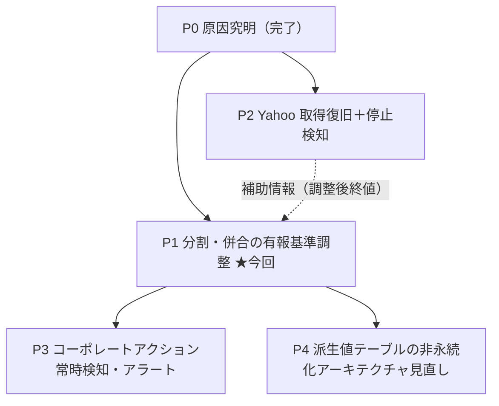

# ロードマップ: 株価データ品質・バリュエーション正確性

- 作成日: 2026-06-22
- 担当: iori-oiso
- 目的: 「株価が誤って表示される」事象（2026年3月末の株式分割未調整）を起点に、株価データ品質とバリュエーション正確性を段階的に立て直す。各フェーズは独立タスク（1 md）として進める。

---

## 背景（確定事実）

- 本番DB実データで、証券コード 1798 が **2026-03-27→03-30 に約5.1倍の価格クリフ**（株式分割 約1:5）を示し、システムが**分割調整を一切行っていない**ため、チャート・最新株価・割安度が誤る。
- 同一日付のサイト間乖離は無く（汚染ではない）、根本は「コーポレートアクション調整機構の不在」。
- 付随して **Yahoo スクレイピングが 2025-01-31 で停止**（別事象）。

---

## フェーズ全体像

| フェーズ | ゴール | 状態 | 依存 | 対応タスク |
|---|---|---|---|---|
| **P0 原因究明** | 実データで原因確定 | **完了** | — | （本ロードマップ背景に集約） |
| **P1 分割・併合の有報基準調整** | チャート/最新/平均/割安度/グレアムを有報基準で正す。自動導出・生値保持・読み出し時補正 | **✅完了（Gate1/2/3 合格・2026-06-22）** | P0 | `T20260621-stock-price-split-adjustment` |
| **P2 Yahoo 無効化＋停止検知** | 原因確定（URL/日付形式変更）。復旧せず無効化し、ソース別停止をSlackアラート化 | **✅完了（Gate1/2/3 合格・2026-06-22）** | なし（P1と並行可） | `T20260621-yahoo-finance-scraping-stopped` |
| **P3 コーポレートアクション常時検知** | （当初案）クリフ＋有報変化を定常監視・通知 | **🚫クローズ（不要・2026-06-22）**：P1が「有報を正とする確定判定」で目的達成済み。暫定の能動監視は価値乏しく非採用 | P1 | `T20260622-corporate-action-monitoring` |
| **P4 非永続化アーキテクチャ見直し** | `valuation`/`investment_indicator`/`corporate_view` を都度算出へ寄せ、陳腐化・再計算の概念を排除 | **⏸️見送り（保留・2026-06-22）**：当面の実害はP1/P2で解消、予防投資のため緊急性低。再改修ニーズ発生時に着手 | P1 | `T20260622-derived-values-depersistence` |

---

## フェーズ間の設計方針（手戻り防止）

- **correctness は P1 で「生データ＋読み出し時補正」に集約**する。これにより:
  - P3（常時検知）は P1 の導出ロジックを再利用するだけ。
  - **P4（非永続化）は「ロジック書き換え」ではなく「キャッシュ層を外すだけ」**になり、P1 の実装が無駄にならない。
- P1 ではキャッシュ（横断一覧用）を**薄く・再構築可能**に保つ。これが P4 への布石。
- P2（Yahoo 復旧）は P1 と独立。ただし Yahoo の調整後終値が復活すれば、P1 の自動導出係数の**クロスチェック材料**に使える（任意）。

---

## 今回（P1）の確定スコープ

詳細は `T20260621-stock-price-split-adjustment.md` の「スコープ確定（2026-06-22 ロック）」を正とする。要約:

- **やる**: 分割係数の自動導出（有報株式数変化＋クリフ、整合時のみ確定）／読み出し時の有報基準補正（最新・平均・チャート・割安度・グレアム/PER/PBR）／単一企業詳細は都度算出／横断キャッシュは対象企業のみ一度再構築／補助系列補正／分割マーカー。
- **やらない**: 全面非永続化（P4）／`stock_price` スキーマ変更・生値書換え／`analysis_result` 変更／Yahoo 復旧（P2）。

---

## 更新履歴

- 2026-06-22: ロードマップ初版作成。P0完了・P1進行中・P2調査完了・P3/P4未着手として整理。
